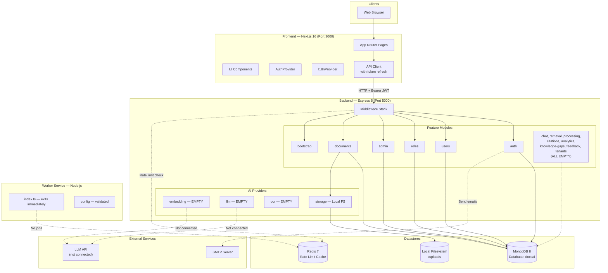
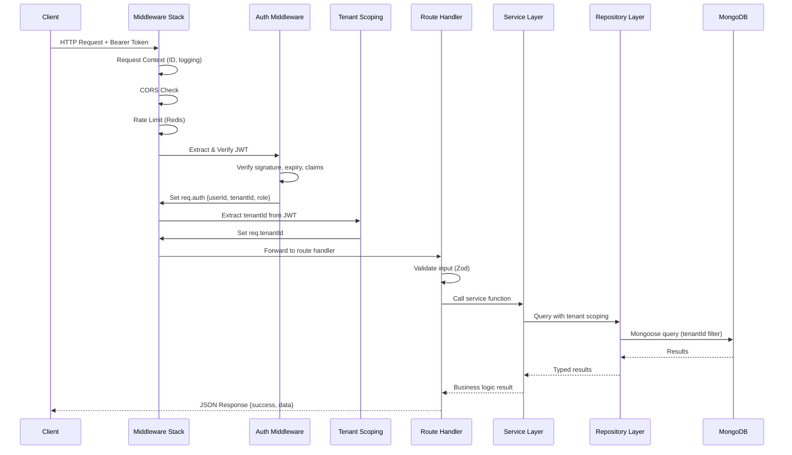
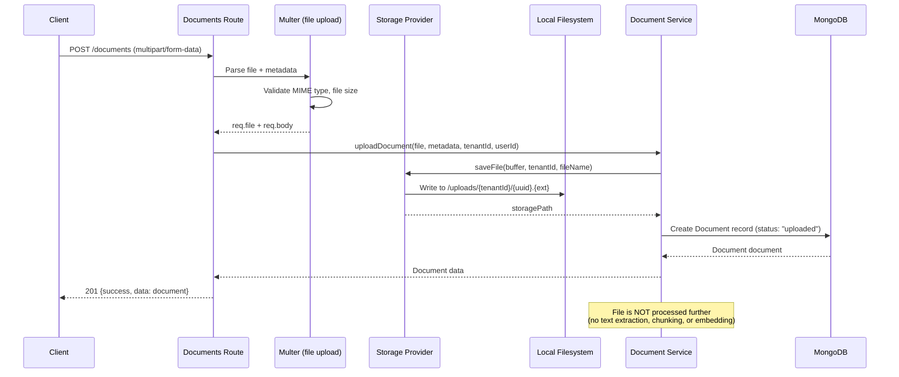
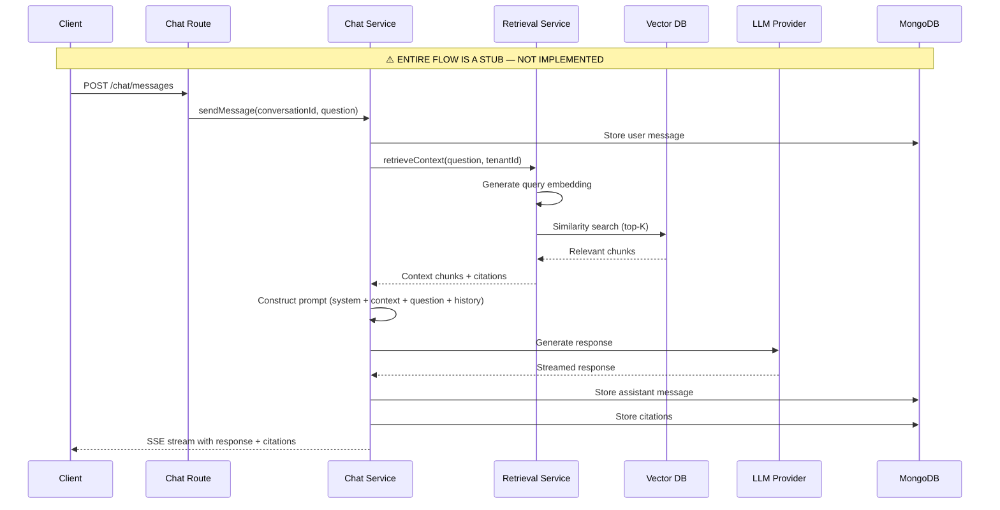
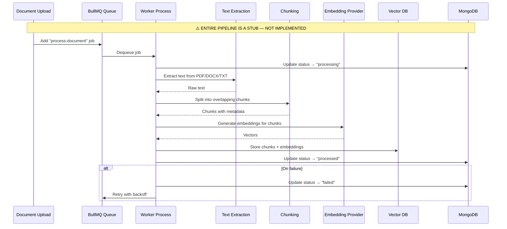
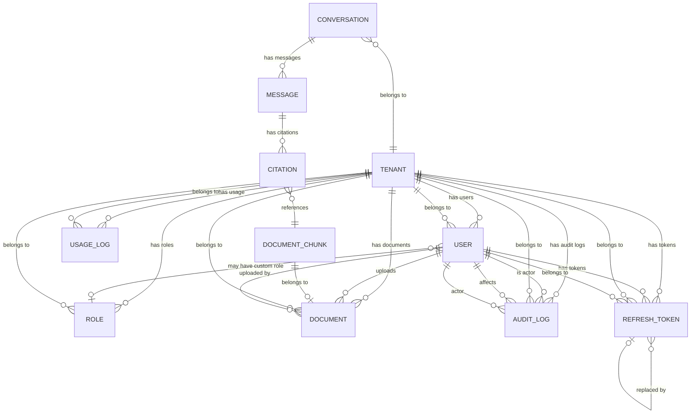
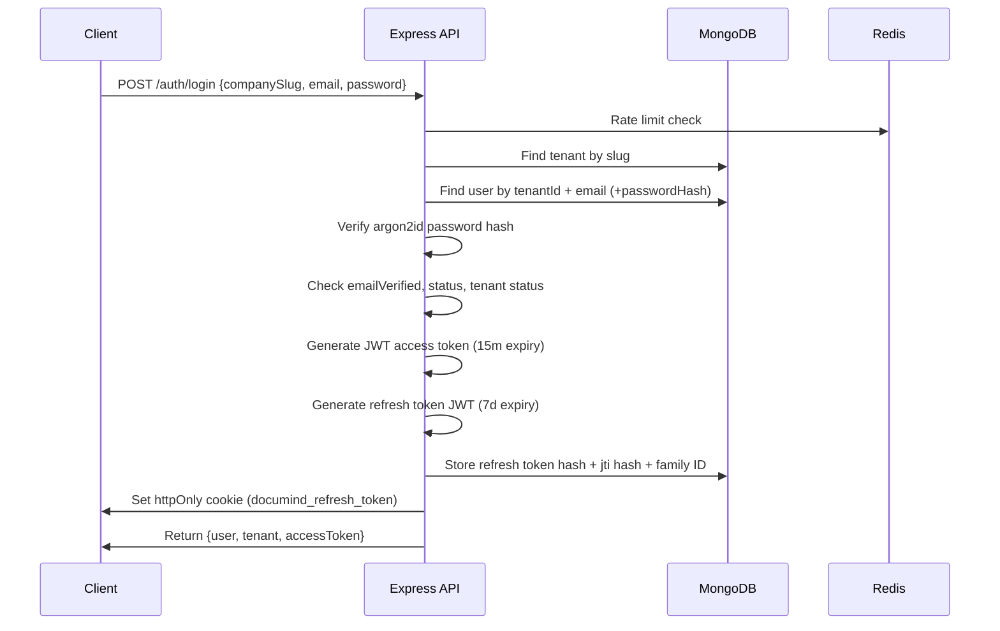
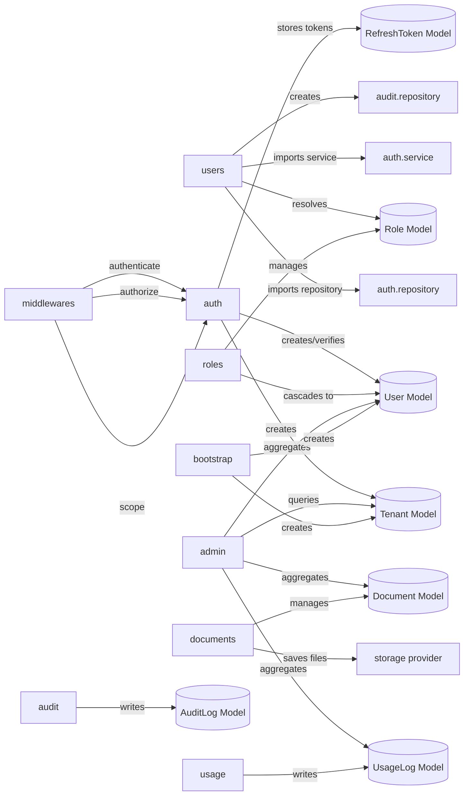

# PROJECT_DISCOVERY_REPORT.md

> **Date:** July 14, 2026
> **Project:** DocuMind AI
> **Author:** Senior Software Architect (automated code inspection)
> **Purpose:** Complete project analysis for architecture handoff

---

# 1. PROJECT OVERVIEW

## Purpose

DocuMind AI is a **private, multi-tenant knowledge assistant** for companies. It allows company administrators to upload internal documents (HR policies, SOPs, contracts, manuals) in Arabic or English, then enables employees to ask natural-language questions and receive accurate answers with source citations.

## Business Problem Solved

Enterprises accumulate vast amounts of internal documentation scattered across file shares, wikis, and email threads. Employees waste significant time searching for answers that already exist in company documents. DocuMind AI solves this by:

1. Centralizing document ingestion with automatic text extraction
2. Using Retrieval-Augmented Generation (RAG) to find relevant passages
3. Generating grounded answers with citation links back to source documents
4. Keeping every tenant's data fully isolated for privacy and compliance

## Target Users

| Role | Description |
|---|---|
| **Platform Super Admin** | Manages the entire platform, onboards tenants, monitors usage |
| **Company Admin (Tenant Admin)** | Manages their company's users, roles, documents, and settings |
| **Employee (Tenant User)** | Asks questions and receives cited answers from company knowledge base |

## Major Features

1. Multi-tenant architecture with complete data isolation
2. JWT authentication with refresh token rotation and reuse detection
3. Role-based access control (RBAC) with custom roles
4. Document upload and management (PDF, DOCX, TXT, MD)
5. (Planned) AI-powered document processing pipeline
6. (Planned) RAG-based conversational chat with citations
7. (Planned) Analytics and knowledge gap detection
8. Internationalization (Arabic + English)
9. Platform admin dashboard for tenant management
10. Super admin bootstrap mechanism

## Current Maturity Level

The project is in **early-to-mid development**. The platform infrastructure (authentication, multi-tenancy, RBAC, document CRUD, frontend shell) is production-quality. The core AI/RAG pipeline — which is the product's primary value proposition — is entirely unimplemented.

## Estimated Completion: ~35-40%

---

# 2. REPOSITORY STRUCTURE

```
documind-ai/
├── .editorconfig                          # Editor config (2-space indent, LF, UTF-8)
├── .github/
│   └── workflows/
│       └── ci.yml                         # GitHub Actions CI pipeline
├── .gitignore                             # Root gitignore
├── .prettierignore                        # Prettier ignore patterns
├── .prettierrc                            # Prettier config (double quotes, semicolons)
├── CICD_DESIGN.md                         # CI/CD design document
├── DocuMind-AI-Flow-and-APIs.md           # Flow and API design document
├── README.md                              # Project README
├── checklist.md                           # Project backlog (123 issues, 8 EPICs)
├── docker-compose.yml                     # Docker Compose orchestration (5 services)
├── docs/
│   └── super-admin-bootstrap.md           # Bootstrap documentation
├── endpoints/
│   ├── auth/
│   ├── authme.http
│   ├── request.md
│   └── root/
├── eslint.config.mjs                      # Root ESLint flat config
├── git_workflow.md                        # Git workflow documentation
├── package.json                           # Root monorepo config (npm workspaces)
├── package-lock.json                      # Root lockfile
├── request.md                             # Request documentation
├── tmp-snippet1.ts                        # Temporary snippet (should be cleaned up)
├── tsconfig.base.json                     # Base TypeScript config (shared)
├── uploads/                               # Uploaded files (tenant-scoped)
│
├── api/                                   # Backend — Express 5 REST API
│   ├── .dockerignore
│   ├── .env                               # Runtime env (gitignored)
│   ├── .env.example                       # Env template (35 vars)
│   ├── .gitignore
│   ├── Dockerfile                         # Dev-only Dockerfile
│   ├── eslint.config.mjs
│   ├── package.json
│   ├── package-lock.json
│   ├── tsconfig.json
│   ├── uploads/                           # API-local uploads directory
│   ├── dist/                              # Compiled output
│   └── src/
│       ├── app.ts                         # Express app (middleware + routes)
│       ├── app.test.ts                    # App integration tests
│       ├── server.ts                      # Server entry (startup + shutdown)
│       ├── routes.ts                      # Empty file
│       ├── common/
│       │   ├── errors/
│       │   │   ├── AppError.ts            # Custom error class
│       │   │   └── errorCodes.ts          # Error code constants
│       │   ├── logger/
│       │   │   └── logger.ts              # Pino logger
│       │   ├── middlewares/
│       │   │   ├── authenticate.middleware.ts
│       │   │   ├── authorize.middleware.ts
│       │   │   ├── authorize.middleware.test.ts
│       │   │   ├── errorHandler.middleware.ts
│       │   │   ├── notFound.middleware.ts
│       │   │   ├── rateLimit.middleware.ts
│       │   │   ├── rateLimit.middleware.test.ts
│       │   │   ├── requestContext.middleware.ts
│       │   │   ├── requestLogger.middleware.ts
│       │   │   ├── tenantScoping.middleware.ts
│       │   │   ├── tenantScoping.middleware.test.ts
│       │   │   └── validateRequest.ts
│       │   └── types/
│       │       └── express.d.ts           # Express type augmentation
│       ├── config/
│       │   ├── env.ts                     # Zod env schema (35 vars)
│       │   └── index.ts                   # Singleton config export
│       ├── db/
│       │   ├── connection.ts              # MongoDB connection with retry
│       │   ├── redis.ts                   # Redis connection singleton
│       │   ├── models/                    # 12 Mongoose models
│       │   │   ├── auditLog.model.ts
│       │   │   ├── citation.model.ts      # EMPTY
│       │   │   ├── conversation.model.ts  # EMPTY
│       │   │   ├── document.model.ts
│       │   │   ├── documentChunk.model.ts # EMPTY
│       │   │   ├── knowledgeGap.model.ts  # EMPTY
│       │   │   ├── message.model.ts       # EMPTY
│       │   │   ├── refreshToken.model.ts
│       │   │   ├── role.model.ts
│       │   │   ├── tenant.model.ts
│       │   │   ├── usageLog.model.ts
│       │   │   └── user.model.ts
│       │   └── repositories/
│       │       ├── tenantScopedRepository.ts
│       │       ├── tenantScopedRepository.test.ts
│       │       └── tenantScopedRepository.memory.test.ts
│       ├── modules/                       # 16 feature modules
│       │   ├── admin/                     # ✅ Platform admin (7 files)
│       │   ├── analytics/                 # ❌ Empty (7 files)
│       │   ├── audit/                     # 🟡 Partial (2 files)
│       │   ├── auth/                      # ✅ Complete (14 files)
│       │   ├── bootstrap/                 # ✅ Complete (5 files)
│       │   ├── chat/                      # ❌ Empty (7 files)
│       │   ├── citations/                 # ❌ Empty (7 files)
│       │   ├── documents/                 # ✅ Complete (8 files)
│       │   ├── feedback/                  # ❌ Empty (7 files)
│       │   ├── knowledge-gaps/            # ❌ Empty (7 files)
│       │   ├── processing/                # ❌ Empty (7 files)
│       │   ├── retrieval/                 # ❌ Empty (7 files)
│       │   ├── roles/                     # ✅ Complete (6 files)
│       │   ├── tenants/                   # ❌ Empty (7 files)
│       │   ├── usage/                     # 🟡 Partial (1 file)
│       │   └── users/                     # ✅ Complete (7 files)
│       ├── providers/
│       │   ├── embedding/index.ts         # ❌ Empty
│       │   ├── llm/index.ts               # ❌ Empty
│       │   ├── ocr/index.ts               # ❌ Empty
│       │   └── storage/index.ts           # ✅ LocalStorageProvider (80 lines)
│       └── scripts/
│           ├── seed-super-admin.ts
│           ├── seed-super-admin.service.ts
│           └── seed-super-admin.service.test.ts
│
├── app/                                   # Frontend — Next.js 16 (App Router)
│   ├── .dockerignore
│   ├── .env.example                       # Env template (4 vars)
│   ├── .gitignore
│   ├── AGENTS.md                          # Agent instructions
│   ├── CLAUDE.md                          # Agent instructions
│   ├── Dockerfile                         # Dev-only Dockerfile
│   ├── README.md
│   ├── eslint.config.mjs
│   ├── next.config.ts
│   ├── package.json
│   ├── postcss.config.mjs
│   ├── tsconfig.json
│   ├── vitest.config.ts
│   ├── public/                            # Static assets
│   └── src/
│       ├── app/                           # Pages (App Router)
│       │   ├── layout.tsx                 # Root layout
│       │   ├── page.tsx                   # Landing page
│       │   ├── globals.css
│       │   ├── (auth)/                    # Auth route group
│       │   │   ├── layout.tsx
│       │   │   ├── login/page.tsx
│       │   │   ├── register/page.tsx
│       │   │   ├── forgot-password/page.tsx
│       │   │   ├── reset-password/page.tsx
│       │   │   └── super-admin/login/page.tsx
│       │   ├── (dashboard)/               # Dashboard route group
│       │   │   ├── layout.tsx
│       │   │   ├── dashboard/
│       │   │   │   ├── page.tsx
│       │   │   │   ├── analytics/page.tsx    # Placeholder
│       │   │   │   ├── documents/page.tsx
│       │   │   │   ├── knowledge-gaps/page.tsx # Placeholder
│       │   │   │   ├── roles/page.tsx
│       │   │   │   ├── settings/page.tsx     # Placeholder
│       │   │   │   └── users/page.tsx
│       │   │   └── super-admin/
│       │   │       ├── page.tsx              # Redirect
│       │   │       └── tenants/
│       │   │           ├── page.tsx          # Redirect
│       │   │           └── tenants-client.tsx
│       │   ├── (platform)/               # Platform admin route group
│       │   │   └── platform/
│       │   │       ├── layout.tsx
│       │   │       └── tenants/
│       │   │           ├── page.tsx
│       │   │           └── [id]/page.tsx
│       │   ├── chat/page.tsx              # Placeholder
│       │   ├── verify-email/
│       │   ├── set-password-from-invite/
│       │   └── logout/page.tsx
│       ├── components/
│       │   ├── auth/                      # Auth guards and navigation
│       │   └── ui/                        # Reusable UI components (11)
│       ├── hooks/features/
│       │   ├── useAuth.ts                 # EMPTY
│       │   ├── useChat.ts                 # EMPTY
│       │   └── useDocuments.ts            # ✅
│       ├── lib/
│       │   ├── api-client.ts              # HTTP client with token refresh
│       │   ├── auth-tokens.ts             # Access token state
│       │   ├── design-tokens.ts           # ⚠️ Unused (dead code)
│       │   ├── role-home.ts               # Role-based redirect
│       │   ├── safe-return-to.ts          # XSS-safe redirect
│       │   ├── utils.ts                   # cn(), formatters
│       │   ├── validation.ts              # Client-side validators
│       │   └── i18n/                      # Internationalization system
│       ├── providers/
│       │   ├── auth-provider.tsx          # ✅ Auth context
│       │   ├── i18n-provider.tsx          # ✅ i18n context
│       │   ├── query-provider.tsx         # EMPTY
│       │   └── theme-provider.tsx         # EMPTY
│       ├── schemas/                       # All EMPTY
│       ├── services/                      # API service wrappers
│       │   ├── analytics.service.ts       # EMPTY
│       │   ├── auth.service.ts            # EMPTY
│       │   ├── chat.service.ts            # EMPTY
│       │   ├── documents.service.ts       # ✅
│       │   ├── platform.service.ts        # ✅
│       │   ├── roles.service.ts           # ✅
│       │   └── users.service.ts           # ✅
│       └── types/api/                     # auth.types.ts, chat.types.ts EMPTY
│
└── workers/                               # Background Worker Service
    ├── .env
    ├── .env.example
    ├── .gitignore
    ├── Dockerfile                         # Dev-only, Node 20
    ├── package.json
    ├── package-lock.json
    ├── tsconfig.json
    └── src/
        ├── index.ts                       # Stub (logs config, exits)
        └── config/
            ├── env.ts                     # Zod env (5 vars)
            └── index.ts
```

## Apps

| App | Technology | Port | Purpose |
|---|---|---|---|
| `api` | Express 5 + Mongoose | 5000 | REST API backend |
| `app` | Next.js 16 + React 19 | 3000 | Frontend SPA |
| `workers` | Node.js | — | Background job processor |

## Shared Libraries

| File | Used By | Purpose |
|---|---|---|
| `tsconfig.base.json` | api, app, workers | Base TypeScript configuration |
| `eslint.config.mjs` | api, app | Shared ESLint rules |

## Configuration Files

| File | Purpose |
|---|---|
| `package.json` | Root monorepo config with npm workspaces |
| `.prettierrc` | Code formatting (double quotes, semicolons, 80 cols) |
| `.editorconfig` | Editor settings (2-space indent, LF, UTF-8) |
| `docker-compose.yml` | Service orchestration |

## Documentation

| File | Purpose |
|---|---|
| `README.md` | Project overview |
| `checklist.md` | Full project backlog (123 issues across 8 EPICs) |
| `CICD_DESIGN.md` | CI/CD design document |
| `DocuMind-AI-Flow-and-APIs.md` | Flow and API design |
| `git_workflow.md` | Git workflow |
| `docs/super-admin-bootstrap.md` | Bootstrap setup guide |
| `app/AGENTS.md` | Agent coding instructions |
| `app/CLAUDE.md` | Agent coding instructions |
| `app/src/components/ui/README.md` | UI component guide |
| `api/src/modules/usage/README.md` | Usage module docs |

## Scripts

| Script | File | Purpose |
|---|---|---|
| Seed super admin | `api/src/scripts/seed-super-admin.ts` | Idempotent super admin creation |

---

# 3. TECHNOLOGY STACK

## Frontend

| Technology | Version | Why Used |
|---|---|---|
| **Next.js** | 16.2.10 | React framework with App Router, file-based routing, server components, Turbopack for fast dev |
| **React** | 19.2.4 | UI component library (latest version with server component support) |
| **Tailwind CSS** | v4 | Utility-first CSS framework for rapid UI development |
| **PostCSS** | — | CSS processing pipeline for Tailwind |
| **clsx** | — | Conditional CSS class joining utility |
| **tailwind-merge** | — | Intelligent Tailwind class deduplication |

## Backend

| Technology | Version | Why Used |
|---|---|---|
| **Express** | 5.2.1 | HTTP framework for REST API (v5 with native async error handling) |
| **Mongoose** | 9.7.3 | MongoDB ODM for schema definition, validation, and query building |
| **Zod** | 4.4.3 | Runtime schema validation for API inputs and environment variables |
| **Multer** | 2.0.0 | Multipart form-data handling for file uploads |
| **Pino** | 10.3.1 | High-performance structured JSON logging |
| **dotenv** | 17.4.2 | Environment variable loading from `.env` files |
| **tsx** | 4.23.0 | TypeScript execution in development (watch mode) |

## Database

| Technology | Version | Why Used |
|---|---|---|
| **MongoDB** | 8 | Document database for flexible schema, native JSON storage, horizontal scaling, Atlas Vector Search capability |
| **Mongoose** | 9.7.3 | Schema-based modeling for MongoDB with built-in validation |

## Authentication

| Technology | Version | Why Used |
|---|---|---|
| **argon2** | 0.44.0 | Memory-hard password hashing (winner of Password Hashing Competition) |
| **Custom JWT** | — | HS256 JWT implementation using Node.js `crypto` (no external dependency) |
| **HMAC-SHA256** | — | Refresh token hashing via Node.js `crypto` |

## Queues

| Technology | Version | Why Used |
|---|---|---|
| **Redis** | 7 | In-memory data store for rate limiting, session caching, and planned job queues |
| **ioredis** | 5.11.1 | Redis client with cluster support and robust error handling |

## Workers

| Technology | Version | Why Used |
|---|---|---|
| **BullMQ** | **Not installed** | Planned: Job queue library for background processing |

## Caching

| Technology | Version | Why Used |
|---|---|---|
| **Redis** | 7 | Rate limiting store (via `rate-limit-redis`), planned for session caching and job queues |

## AI / RAG

| Technology | Version | Why Used |
|---|---|---|
| **None installed** | — | All AI providers (embedding, LLM, OCR) are empty stubs. No AI SDKs in any `package.json`. |

## LLMs

| Technology | Version | Why Used |
|---|---|---|
| **None configured** | — | `providers/llm/index.ts` is empty. No OpenAI, Anthropic, or Google SDK installed. No API keys in `.env.example`. |

## Embeddings

| Technology | Version | Why Used |
|---|---|---|
| **None configured** | — | `providers/embedding/index.ts` is empty. No embedding library installed. |

## Vector Search

| Technology | Version | Why Used |
|---|---|---|
| **None configured** | — | No vector database (Pinecone, Qdrant, ChromaDB) configured. MongoDB Atlas Vector Search is mentioned in the landing page but not implemented. |

## OCR

| Technology | Version | Why Used |
|---|---|---|
| **None configured** | — | `providers/ocr/index.ts` is empty. No Tesseract.js or cloud OCR SDK installed. |

## Testing

| Technology | Version | Why Used |
|---|---|---|
| **Vitest** | 4.1.10 | Fast test runner for frontend (React component tests, unit tests) |
| **Node.js test runner** | Built-in | Backend testing (no Jest dependency) |
| **mongodb-memory-server** | 11.2.0 | In-memory MongoDB for integration tests without external DB |

## CI/CD

| Technology | Version | Why Used |
|---|---|---|
| **GitHub Actions** | — | CI pipeline with path-filtered builds, linting, testing, and compilation |
| **dorny/paths-filter** | v3 | Path-based change detection to skip unchanged workspaces |

## Docker

| Technology | Version | Why Used |
|---|---|---|
| **Docker** | — | Containerization for all three services |
| **Docker Compose** | — | Multi-service orchestration with health checks and volume management |
| **node:22-bullseye-slim** | — | API base image (includes native build tools for argon2) |
| **node:22-alpine** | — | App base image (minimal footprint) |
| **node:20-alpine** | — | Worker base image (inconsistent version — should be 22) |

## Email

| Technology | Version | Why Used |
|---|---|---|
| **Nodemailer** | 9.0.3 | SMTP email delivery for verification, invitations, and password reset |

---

# 4. SYSTEM ARCHITECTURE

## Overall Architecture



## Request Flow



## Upload Flow



## Chat Flow (NOT IMPLEMENTED)



## Worker Pipeline (NOT IMPLEMENTED)



## Communication Between Components

| From | To | Protocol | Purpose |
|---|---|---|---|
| Frontend | API | HTTP/HTTPS | REST API calls with Bearer JWT |
| API | MongoDB | TCP (27017) | Database queries via Mongoose |
| API | Redis | TCP (6379) | Rate limiting, session state |
| API | SMTP | TCP (587/465) | Email delivery via Nodemailer |
| API | Local FS | File I/O | Document storage/retrieval |
| Worker | MongoDB | TCP (27017) | Job state, document status |
| Worker | Redis | TCP (6379) | Job queue (planned BullMQ) |
| Docker Compose | All | Bridge network | Service discovery by hostname |

---

# 5. DATABASE ANALYSIS

## Implemented Models

### Tenant

**Purpose:** Represents a company/organization. Root entity for multi-tenancy.

| Field | Type | Required | Constraints |
|---|---|---|---|
| `name` | String | Yes | trim, minlength 2, maxlength 120 |
| `slug` | String | Yes | unique, lowercase, trim, minlength 2, maxlength 80 |
| `status` | String | No | enum: `active`, `trial`, `pending`, `pending_verification`, `suspended`; default: `pending_verification` |
| `plan` | String | No | enum: `free`, `trial`, `pro`; default: `free` |
| `isSystemTenant` | Boolean | No | default: false |
| `createdAt` | Date | Auto | timestamps: true |
| `updatedAt` | Date | Auto | timestamps: true |

**Indexes:** `{slug:1}` unique, `{isSystemTenant:1}`, `{status:1}`
**Relationships:** None (root entity)
**Used by:** All tenant-scoped modules, auth, admin, bootstrap, documents
**Status:** ✅ Complete
**Missing:** No subscription/billing fields, no feature flags, no tenant settings object

---

### User

**Purpose:** Represents a user within a tenant. Supports system roles (SUPER_ADMIN, COMPANY_ADMIN, EMPLOYEE) and custom roles.

| Field | Type | Required | Constraints |
|---|---|---|---|
| `tenantId` | ObjectId | Yes | ref: Tenant, indexed |
| `name` | String | Yes | trim, minlength 2, maxlength 120 |
| `email` | String | Yes | trim, lowercase, maxlength 254 |
| `passwordHash` | String | Yes | select: false |
| `role` | String | Yes | (SUPER_ADMIN, COMPANY_ADMIN, EMPLOYEE) |
| `customRoleId` | ObjectId | No | ref: Role, default: null |
| `status` | String | No | enum: `active`, `pending`, `pending_email_verification`, `disabled`; default: `pending_email_verification` |
| `emailVerified` | Boolean | No | default: false |
| `emailVerifiedAt` | Date | No | default: null |
| `emailVerificationTokenHash` | String | No | select: false |
| `emailVerificationExpiresAt` | Date | No | select: false |
| `passwordResetTokenHash` | String | No | select: false |
| `passwordResetExpiresAt` | Date | No | default: null, select: false |

**Indexes:** `{tenantId:1}`, `{tenantId:1,email:1}` unique (`uniq_user_tenant_email`), `{role:1}` unique partial for SUPER_ADMIN only (`uniq_initial_super_admin`), `{email:1}` (`idx_user_email`)
**Relationships:** tenantId → Tenant, customRoleId → Role
**Used by:** auth, users, roles, admin, bootstrap, documents
**Status:** ✅ Complete
**Missing:** Avatar/profile image, phone number, last login timestamp, login count

---

### Role

**Purpose:** Custom tenant-scoped roles that map to system base roles.

| Field | Type | Required | Constraints |
|---|---|---|---|
| `tenantId` | ObjectId | Yes | ref: Tenant, indexed |
| `name` | String | Yes | trim, minlength 2, maxlength 50 |
| `normalizedName` | String | Yes | (for case-insensitive uniqueness) |
| `baseRole` | String | Yes | enum: `COMPANY_ADMIN`, `EMPLOYEE` |

**Indexes:** `{tenantId:1}`, `{tenantId:1,normalizedName:1}` unique (`uniq_role_tenant_name`)
**Relationships:** tenantId → Tenant
**Used by:** roles module, users module
**Status:** ✅ Complete
**Missing:** Permissions array, description field

---

### Document

**Purpose:** Represents an uploaded document within a tenant.

| Field | Type | Required | Constraints |
|---|---|---|---|
| `tenantId` | ObjectId | Yes | ref: Tenant, indexed |
| `fileName` | String | Yes | trim, maxlength 255 |
| `fileSize` | Number | Yes | min: 0 |
| `mimeType` | String | Yes | — |
| `storagePath` | String | Yes | — |
| `status` | String | No | enum: `uploading`, `uploaded`, `processing`, `processed`, `failed`; default: `uploaded` |
| `metadata.title` | String | No | default: null, maxlength 200 |
| `metadata.description` | String | No | default: null, maxlength 1000 |
| `metadata.tags` | [String] | No | default: [], maxlength 10 |
| `uploadedBy` | ObjectId | Yes | ref: User |
| `createdAt` | Date | Auto | — |
| `updatedAt` | Date | Auto | — |

**Indexes:** `{tenantId:1}`, `{tenantId:1,createdAt:-1}`, `{tenantId:1,status:1}`
**Relationships:** tenantId → Tenant, uploadedBy → User
**Used by:** documents module, admin module
**Status:** ✅ Complete (CRUD only)
**Missing:** Processing metadata (page count, word count, language), chunking status, version tracking, download endpoint

---

### RefreshToken

**Purpose:** Stores refresh token metadata for rotation, reuse detection, and revocation.

| Field | Type | Required | Constraints |
|---|---|---|---|
| `tenantId` | ObjectId | Yes | ref: Tenant |
| `userId` | ObjectId | Yes | ref: User |
| `tokenHash` | String | Yes | unique |
| `jtiHash` | String | Yes | unique |
| `familyId` | String | Yes | — |
| `expiresAt` | Date | Yes | TTL index (auto-delete) |
| `revokedAt` | Date | No | default: null |
| `replacedByTokenId` | ObjectId | No | ref: RefreshToken (self), default: null |
| `reuseDetectedAt` | Date | No | default: null |
| `createdByIp` | String | No | optional |
| `revokedByIp` | String | No | optional |
| `userAgent` | String | No | optional |

**Indexes:** `{tokenHash:1}` unique, `{jtiHash:1}` unique, `{tenantId:1,userId:1}`, `{familyId:1}`, `{expiresAt:1}` TTL, `{tenantId:1,userId:1,revokedAt:1}`
**Relationships:** tenantId → Tenant, userId → User, replacedByTokenId → RefreshToken (self)
**Used by:** auth module only
**Status:** ✅ Complete

---

### AuditLog

**Purpose:** Immutable audit trail for user lifecycle events.

| Field | Type | Required | Constraints |
|---|---|---|---|
| `tenantId` | ObjectId | Yes | ref: Tenant, indexed |
| `userId` | ObjectId | Yes | ref: User (affected entity) |
| `resourceType` | String | Yes | — |
| `resourceId` | String | Yes | — |
| `action` | String | Yes | — |
| `actorId` | ObjectId | Yes | ref: User (who performed action) |
| `actorEmail` | String | Yes | — |
| `actorRole` | String | Yes | — |
| `changes` | Mixed | Yes | default: {} |
| `createdAt` | Date | Auto | timestamps: {createdAt: true, updatedAt: false} |

**Indexes:** `{tenantId:1}`, `{tenantId:1,createdAt:-1}`, `{tenantId:1,resourceType:1,resourceId:1}`
**Relationships:** tenantId → Tenant, userId → User, actorId → User
**Used by:** users module (creates logs), audit repository
**Status:** 🟡 Partial — write-only, no query API
**Missing:** Query API, filtering, UI, document/chat audit events

---

### UsageLog

**Purpose:** Tracks usage events per tenant (questions asked, responses, system events).

| Field | Type | Required | Constraints |
|---|---|---|---|
| `tenantId` | ObjectId | Yes | ref: Tenant |
| `eventType` | String | Yes | enum: `QUESTION_ASKED`, `ASSISTANT_RESPONSE`, `SYSTEM_EVENT` |
| `requestId` | String | No | trim, unique partial (when string type) |
| `createdAt` | Date | Auto | timestamps: {createdAt: true, updatedAt: false} |

**Indexes:** `{tenantId:1,eventType:1}`, `{tenantId:1,requestId:1}` unique partial
**Relationships:** tenantId → Tenant
**Used by:** usage service, admin repository (stats aggregation)
**Status:** 🟡 Partial — only `recordQuestionAsked` exists, no query API
**Missing:** Query API, dashboard, aggregation pipeline, LLM token tracking

---

## Empty/Stub Models (0 bytes each)

| Model | Expected Purpose | Fields Needed |
|---|---|---|
| `citation.model.ts` | Links between assistant messages and source document chunks | conversationId, messageId, chunkId, documentId, relevanceScore, quoteText, page, position |
| `conversation.model.ts` | Chat conversation metadata | tenantId, userId, title, documentScope, createdAt, updatedAt |
| `documentChunk.model.ts` | Chunked text segments with embedding vectors | tenantId, documentId, chunkIndex, content, embedding (vector), metadata (page, position, section) |
| `knowledgeGap.model.ts` | Tracks questions that couldn't be answered | tenantId, question, frequency, lastAskedAt, resolvedAt |
| `message.model.ts` | Individual messages in a conversation | conversationId, role (user/assistant/system), content, tokenCount, citations[] |

## Entity Relationships



## Migration Status

No migration system exists. MongoDB schemas are defined via Mongoose and applied automatically on model compilation. No versioned migrations, no schema versioning.

---

# 6. BACKEND ANALYSIS

## Module: `auth`

**Purpose:** Complete authentication system with registration, login, token management, email verification, and password reset.

| Component | File | Lines | Status |
|---|---|---|---|
| Controller | `auth.controller.ts` | 258 | ✅ 10 handlers |
| Service | `auth.service.ts` | 949 | ✅ 11 functions |
| Repository | `auth.repository.ts` | 271 | ✅ 25+ operations |
| Validator | `auth.validator.ts` | 160 | ✅ 7 Zod schemas |
| Routes | `auth.routes.ts` | 33 | ✅ 10 endpoints |
| Types | `auth.types.ts` | 127 | ✅ |
| DTO | `auth.dto.ts` | 15 | ✅ |
| JWT | `jwtTokens.ts` | 90 | ✅ Custom HS256 |
| Password | `passwordHashing.ts` | 23 | ✅ argon2id |
| Refresh Hash | `refreshTokenHashing.ts` | 16 | ✅ HMAC-SHA256 |
| Email Token | `emailVerificationToken.ts` | 161 | ✅ Separate JWT secret |
| Reset Token | `passwordResetToken.ts` | 94 | ✅ 15-min expiry |
| Mailer | `auth.mailer.ts` | 382 | ✅ HTML templates |
| Tests | `auth.mailer.test.ts` | 53 | ✅ |

**Missing:** Account lockout, IP-based refresh token binding, JWT key rotation

---

## Module: `users`

**Purpose:** User lifecycle management — invite, update, delete, set password from invite.

| Component | File | Lines | Status |
|---|---|---|---|
| Controller | `users.controller.ts` | 164 | ✅ 6 handlers |
| Service | `users.service.ts` | 499 | ✅ 6 functions |
| Repository | `users.repository.ts` | 62 | ✅ |
| Validator | `users.validator.ts` | 190 | ✅ 4 schemas |
| Routes | `users.routes.ts` | 51 | ✅ 6 endpoints |
| Types | `users.types.ts` | 57 | ✅ |

**Missing:** Bulk import, profile editing, user activity log

---

## Module: `roles`

**Purpose:** Custom role CRUD with cascade updates.

| Component | File | Lines | Status |
|---|---|---|---|
| Controller | `roles.controller.ts` | 123 | ✅ 4 handlers |
| Service | `roles.service.ts` | 175 | ✅ 4 functions |
| Validator | `roles.validator.ts` | 73 | ✅ 2 schemas |
| Routes | `roles.routes.ts` | 46 | ✅ 4 endpoints |
| Types | `roles.types.ts` | 31 | ✅ |
| Tests | `roles.test.ts` | 553 | ✅ 11 test cases |

**Missing:** Permissions model, role descriptions, role hierarchy

---

## Module: `admin`

**Purpose:** Platform super-admin tenant management.

| Component | File | Lines | Status |
|---|---|---|---|
| Controller | `admin.controller.ts` | 79 | ✅ 3 handlers |
| Service | `admin.service.ts` | 121 | ✅ 3 functions |
| Repository | `admin.repository.ts` | 65 | ✅ Aggregation |
| Validator | `admin.validator.ts` | 128 | ✅ 3 schemas |
| Routes | `admin.routes.ts` | 43 | ✅ 3 endpoints |
| Types | `admin.types.ts` | 50 | ✅ |

**Missing:** Tenant creation API (only bootstrap), tenant deletion, bulk operations

---

## Module: `bootstrap`

**Purpose:** One-time super admin creation with security protections.

| Component | File | Lines | Status |
|---|---|---|---|
| Controller | `bootstrap.controller.ts` | 13 | ✅ 1 handler |
| Service | `bootstrap.service.ts` | 38 | ✅ 1 function |
| Validator | `bootstrap.validator.ts` | 16 | ✅ 1 schema |
| Routes | `bootstrap.routes.ts` | 15 | ✅ 1 endpoint |
| Tests | `bootstrap.validator.test.ts` | 12 | ✅ |

**Status:** ✅ Complete — rate-limited, one-time use, key-protected

---

## Module: `documents`

**Purpose:** Document upload and CRUD with local filesystem storage.

| Component | File | Lines | Status |
|---|---|---|---|
| Controller | `documents.controller.ts` | 175 | ✅ 5 handlers |
| Service | `documents.service.ts` | 189 | ✅ 5 functions |
| Repository | `documents.repository.ts` | 56 | ✅ 6 operations |
| Validator | `documents.validator.ts` | 134 | ✅ 3 schemas |
| Routes | `documents.routes.ts` | 78 | ✅ 5 endpoints |
| Types | `documents.types.ts` | 69 | ✅ |
| Tests | `documents.test.ts` | — | ✅ |
| Provider | `storage/index.ts` | 80 | ✅ LocalStorageProvider |

**Missing:** Document download/preview, re-processing, versioning, cloud storage, text extraction

---

## Module: `audit`

**Purpose:** Audit log creation utility (no API surface).

| Component | File | Lines | Status |
|---|---|---|---|
| Repository | `audit.repository.ts` | 7 | 🟡 Single function |
| Types | `audit.types.ts` | 11 | ✅ |

**Missing:** Query API, controller, routes, service, UI, broader event coverage

---

## Module: `usage`

**Purpose:** Usage event recording utility (no API surface).

| Component | File | Lines | Status |
|---|---|---|---|
| Service | `usage.service.ts` | 37 | 🟡 Single function |

**Missing:** Controller, routes, query API, aggregation, dashboard

---

## Empty Modules (all 7 files, 0 lines each)

| Module | Purpose | Status |
|---|---|---|
| `chat` | Conversational RAG interface | ❌ Empty |
| `retrieval` | Semantic search / hybrid retrieval | ❌ Empty |
| `processing` | Document processing pipeline | ❌ Empty |
| `citations` | Source citation tracking | ❌ Empty |
| `analytics` | Usage analytics and dashboards | ❌ Empty |
| `knowledge-gaps` | Unresolved question detection | ❌ Empty |
| `feedback` | User feedback collection | ❌ Empty |
| `tenants` | User-facing tenant management | ❌ Empty |

---

# 7. API INVENTORY

## Active Endpoints (32 routes)

| Method | Route | Auth | Validation | Controller | Service Function | Response Shape | Frontend Consumer | Status |
|---|---|---|---|---|---|---|---|---|
| GET | `/` | Public | None | `app.ts` inline | None | `{message}` | None | ✅ |
| GET | `/healthz` | Public | None | `app.ts` inline | None | `{status:"ok"}` | Docker healthcheck | ✅ |
| GET | `/readyz` | Public | None | `app.ts` inline | Checks Mongo+Redis | `{status,checks}` | Docker healthcheck | ✅ |
| POST | `/auth/register` | Public | `registerSchema` | `registerController` | `registerTenantAndAdmin` | `{tenant,user}` | `/register` page | ✅ |
| POST | `/auth/login` | Public | `loginSchema` | `loginController` | `login` | `{user,tenant,accessToken}` + cookie | `/login` page | ✅ |
| POST | `/auth/super-admin/login` | Public | `superAdminLoginSchema` | `superAdminLoginController` | `superAdminLogin` | `{user,tenant,accessToken}` + cookie | `/super-admin/login` | ✅ |
| POST | `/auth/refresh` | Public (cookie) | None | `refreshController` | `refreshAccessToken` | `{accessToken}` + rotated cookie | `auth-provider` | ✅ |
| POST | `/auth/logout` | Public (cookie) | None | `logoutController` | `logout` | `{message}` | `auth-provider` | ✅ |
| POST | `/auth/verify-email` | Public | `verifyEmailSchema` | `verifyEmailController` | `verifyEmail` | `{message}` | `/verify-email` | ✅ |
| POST | `/auth/resend-verification-email` | Public | `resendVerificationSchema` | `resendVerificationEmailController` | `resendVerificationEmail` | `{message}` | — | ✅ |
| POST | `/auth/forgot-password` | Public | `forgotPasswordSchema` | `forgotPasswordController` | `forgotPassword` | `{message}` | `/forgot-password` | ✅ |
| POST | `/auth/reset-password` | Public | `resetPasswordSchema` | `resetPasswordController` | `resetPassword` | `{message}` | `/reset-password` | ✅ |
| GET | `/auth/me` | Bearer JWT | None | `meController` | `getMe` | `{user,tenant}` | `auth-provider` | ✅ |
| GET | `/users/` | Bearer JWT + COMPANY_ADMIN or EMPLOYEE | `listUsersSchema` | `listUsersController` | `listUsers` | `{users[],pagination}` | `/dashboard/users`, `/dashboard` | ✅ |
| POST | `/users/` | Bearer JWT + COMPANY_ADMIN | `inviteUserSchema` | `inviteUserController` | `inviteUser` | `{user}` | `/dashboard/users` | ✅ |
| PATCH | `/users/:id` | Bearer JWT + COMPANY_ADMIN | `updateUserSchema` | `updateUserController` | `updateUser` | `{user}` | `/dashboard/users` | ✅ |
| DELETE | `/users/:id` | Bearer JWT + COMPANY_ADMIN | `idParamSchema` | `deleteUserController` | `deleteUser` | `{message}` | `/dashboard/users` | ✅ |
| POST | `/users/set-password-from-invite` | Public | `setPasswordFromInviteSchema` | `setPasswordFromInviteController` | `setPasswordFromInvite` | `{message}` | `/set-password-from-invite` | ✅ |
| POST | `/users/validate-invite` | Public | `tokenSchema` | `getInviteDetailsController` | `getInviteDetails` | `{companyName,email,role,expiresAt}` | `/set-password-from-invite` | ✅ |
| GET | `/roles/` | Bearer JWT + COMPANY_ADMIN | None | `listRolesController` | `listRoles` | `{roles[]}` | `/dashboard/users`, `/dashboard/roles` | ✅ |
| POST | `/roles/` | Bearer JWT + COMPANY_ADMIN | `createRoleSchema` | `createRoleController` | `createRole` | `{role}` | `/dashboard/roles` | ✅ |
| PATCH | `/roles/:id` | Bearer JWT + COMPANY_ADMIN | `updateRoleSchema` | `updateRoleController` | `updateRole` | `{role}` | `/dashboard/roles` | ✅ |
| DELETE | `/roles/:id` | Bearer JWT + COMPANY_ADMIN | `idParamSchema` | `deleteRoleController` | `deleteRole` | `{message}` | `/dashboard/roles` | ✅ |
| GET | `/platform/tenants` | Bearer JWT + SUPER_ADMIN | `listTenantsSchema` | `listTenantsController` | `listTenants` | `{tenants[],pagination}` | `/platform/tenants` | ✅ |
| GET | `/platform/tenants/:id` | Bearer JWT + SUPER_ADMIN | `idParamSchema` | `getTenantController` | `getTenant` | `{tenant}` | `/platform/tenants/[id]` | ✅ |
| PATCH | `/platform/tenants/:id` | Bearer JWT + SUPER_ADMIN | `updateTenantSchema` | `updateTenantController` | `updateTenant` | `{tenant}` | `/platform/tenants` | ✅ |
| POST | `/internal/bootstrap/super-admin` | Public (bootstrap key header) | `bootstrapSchema` | `bootstrapSuperAdminController` | `bootstrapSuperAdmin` | `{tenantId,userId,email}` | Script/CLI only | ✅ |
| POST | `/documents/` | Bearer JWT + COMPANY_ADMIN or EMPLOYEE | `uploadDocumentSchema` + multer | `uploadDocumentController` | `uploadDocument` | `{document}` | `/dashboard/documents` | ✅ |
| GET | `/documents/` | Bearer JWT + COMPANY_ADMIN or EMPLOYEE | `listDocumentsSchema` | `listDocumentsController` | `listDocuments` | `{documents[],pagination}` | `/dashboard/documents` | ✅ |
| GET | `/documents/:id` | Bearer JWT + COMPANY_ADMIN or EMPLOYEE | `idParamSchema` | `getDocumentController` | `getDocument` | `{document}` | — | ✅ |
| PATCH | `/documents/:id` | Bearer JWT + COMPANY_ADMIN or EMPLOYEE | `updateDocumentMetadataSchema` | `updateDocumentMetadataController` | `updateDocumentMetadata` | `{document}` | — | ✅ |
| DELETE | `/documents/:id` | Bearer JWT + COMPANY_ADMIN or EMPLOYEE | `idParamSchema` | `deleteDocumentController` | `deleteDocument` | `{message}` | `/dashboard/documents` | ✅ |

## Dev-Only Endpoints (not in production)

| Method | Route | Description |
|---|---|---|
| GET | `/boom` | Throws AppError(400) for testing error handler |
| POST | `/signup` | Inline validation test endpoint |

## Missing Endpoints (expected but not implemented)

| Expected Route | Module | Purpose |
|---|---|---|
| POST/GET/DELETE `/chat/*` | chat | Conversation management, message sending |
| POST `/retrieval/search` | retrieval | Semantic search |
| POST `/processing/process/:documentId` | processing | Trigger document processing |
| GET `/citations/*` | citations | Citation retrieval |
| GET `/analytics/*` | analytics | Usage analytics data |
| GET `/knowledge-gaps/*` | knowledge-gaps | Knowledge gap data |
| POST `/feedback/*` | feedback | User feedback |
| GET/PATCH `/tenants/*` | tenants | Tenant self-service settings |
| GET `/audit-logs` | audit | Audit log query |
| GET `/documents/:id/download` | documents | File download |
| GET `/documents/:id/preview` | documents | Document preview |

---

# 8. FRONTEND ANALYSIS

## Pages

| Route | Purpose | Components | State | Connected APIs | Missing | UI % |
|---|---|---|---|---|---|---|
| `/` | Marketing landing page | Inline HTML/CSS/JS | Local state | None | i18n | 100% |
| `/login` | Tenant user login | AuthHeroPanel, LanguageSwitcher | Form state, error | `POST /auth/login` | — | 100% |
| `/register` | Tenant + admin registration | AuthHeroPanel, LanguageSwitcher | Form state, slug generation | `POST /auth/register`, `POST /auth/refresh` | — | 100% |
| `/forgot-password` | Request password reset email | AuthHeroPanel, LanguageSwitcher | Form state | `POST /auth/forgot-password` | — | 100% |
| `/reset-password` | Set new password via token | LanguageSwitcher | Form state | `POST /auth/reset-password` | — | 100% |
| `/super-admin/login` | Platform admin login | None | Form state | `POST /auth/super-admin/login` | i18n | 100% |
| `/verify-email` | Email verification | AuthPageShell | Async verification state | `POST /auth/verify-email` | Partial i18n | 100% |
| `/set-password-from-invite` | Set password from invite link | AuthPageShell | Form state, invite validation | `POST /users/validate-invite`, `POST /users/set-password-from-invite` | Partial i18n | 100% |
| `/dashboard` | Main dashboard | StatCard, Badge | User list (auto-paginated) | `GET /users` | Documents/AI cards are "Coming soon" | 70% |
| `/dashboard/documents` | Document management | FileDropzone, ProgressBar, Badge, Skeleton, Button | useDocuments hook | `GET/POST/DELETE /documents` | — | 95% |
| `/dashboard/users` | User management | Button, Badge | Inline row editing | `GET/POST/PATCH/DELETE /users`, `GET /roles` | i18n | 90% |
| `/dashboard/roles` | Custom role management | Button | CRUD state | `GET/POST/PATCH/DELETE /roles` | i18n | 90% |
| `/dashboard/analytics` | Analytics dashboard | None | None | None | Everything (placeholder) | 5% |
| `/dashboard/knowledge-gaps` | Knowledge gap insights | None | None | None | Everything (placeholder) | 5% |
| `/dashboard/settings` | Settings | None | None | None | Everything (placeholder) | 5% |
| `/chat` | Conversational chat | ProtectedRoute wrapper | None | None | Everything (placeholder) | 5% |
| `/platform/tenants` | Tenant management (super admin) | TenantsClient (URL-driven state) | URL search params | `GET/PATCH /platform/tenants` | i18n | 90% |
| `/platform/tenants/[id]` | Tenant detail | StatCard, Badge, Skeleton | Route param + fetch | `GET /platform/tenants/:id` | i18n | 85% |

## UI Components (11)

| Component | File | Status | Notes |
|---|---|---|---|
| `Button` | `components/ui/Button.tsx` | ✅ | 5 variants, 3 sizes, loading state |
| `Badge` | `components/ui/Badge.tsx` | ✅ | Semantic status colors |
| `Card` | `components/ui/Card.tsx` | ✅ | Card + Header + Title + Content |
| `Input` | `components/ui/Input.tsx` | ✅ | Label, error, helper, ARIA |
| `Avatar` | `components/ui/Avatar.tsx` | ✅ | Image + initials fallback |
| `StatCard` | `components/ui/StatCard.tsx` | ✅ | KPI tile with label/value/tag |
| `Skeleton` | `components/ui/Skeleton.tsx` | ✅ | Loading placeholder |
| `ProgressBar` | `components/ui/ProgressBar.tsx` | ✅ | Accessible progress |
| `FileDropzone` | `components/ui/FileDropzone.tsx` | ✅ | Drag-drop file selection |
| `LanguageSwitcher` | `components/ui/LanguageSwitcher.tsx` | ✅ | Locale cycling |
| `AuthHeroPanel` | `components/ui/AuthHeroPanel.tsx` | ✅ | Auth page left panel |

## Providers (4)

| Provider | File | Status | Notes |
|---|---|---|---|
| `AuthProvider` | `auth-provider.tsx` | ✅ | Session restore, login/logout, user/tenant state |
| `I18nProvider` | `i18n-provider.tsx` | ✅ | Locale, direction, translation function |
| `QueryProvider` | `query-provider.tsx` | ❌ Empty | Intended for React Query |
| `ThemeProvider` | `theme-provider.tsx` | ❌ Empty | Intended for dark mode |

## Empty Frontend Files (0 lines)

- `hooks/features/useAuth.ts`, `hooks/features/useChat.ts`
- `services/auth.service.ts`, `services/chat.service.ts`, `services/analytics.service.ts`
- `providers/query-provider.tsx`, `providers/theme-provider.tsx`
- `types/api/auth.types.ts`, `types/api/chat.types.ts`
- `schemas/auth.schema.ts`, `schemas/document.schema.ts`, `schemas/chat.schema.ts`
- `constants/routes.ts`, `constants/storage.ts`

## Design Tokens

`app/src/lib/design-tokens.ts` (101 lines) — Defines color palette, typography roles, spacing, radius, and chart colors. **Entirely unused** — no file in the codebase imports from this module. Dead code.

---

# 9. AUTHENTICATION & AUTHORIZATION

## Login Flow



## JWT Implementation

| Property | Value |
|---|---|
| Algorithm | HS256 (HMAC-SHA256) |
| Access Token Expiry | 15 minutes (configurable) |
| Refresh Token Expiry | 7 days (configurable) |
| Claims | `sub` (userId), `tenantId`, `role`, `email`, `type` ("access"/"refresh"), `jti` |
| Signing | Custom implementation using `crypto.createHmac` |
| Verification | Timing-safe comparison via `crypto.timingSafeEqual` |
| Separate Secrets | 4 independent secrets: access, refresh, email verification, password reset |

## Session Management

- **Access Token:** Sent in `Authorization: Bearer` header, stateless
- **Refresh Token:** Stored as httpOnly cookie (`documind_refresh_token`), path-scoped to `/auth`
- **Rotation:** Every refresh generates a new token with the same `familyId`, atomically revoking the old one
- **Reuse Detection:** If a revoked token is presented, the entire family is revoked (security signal)
- **Cookie Options:** `httpOnly: true`, `secure: true` (production), `sameSite: "none"` (secure) or `"lax"` (dev)

## RBAC

| Role | Description | Permissions |
|---|---|---|
| `SUPER_ADMIN` | Platform administrator | Manage all tenants, view platform stats |
| `COMPANY_ADMIN` | Tenant administrator | Manage users, roles, documents within their tenant |
| `EMPLOYEE` | Tenant user | List users, upload/manage own documents (same as COMPANY_ADMIN for documents) |

**Custom Roles:** Tenant-scoped roles that map to a `baseRole` (COMPANY_ADMIN or EMPLOYEE). The actual authorization check uses the `baseRole`, not the custom role name. Custom roles are display/label-only.

## Tenant Isolation

Every data access operation flows through `tenantScopedRepository.ts`, which injects `{ tenantId }` into all queries. The `tenantScoping` middleware extracts `tenantId` from the JWT (already signature-verified) and sets `req.tenantId`. This provides defense-in-depth: even if a developer forgets to scope a query, the middleware ensures the tenantId is available.

## Guards (Frontend)

| Guard | Component | Behavior |
|---|---|---|
| `GuestOnly` | `auth-guard.tsx` | Redirects authenticated users to their role home |
| `ProtectedRoute` | `auth-guard.tsx` | Redirects unauthenticated users to `/login?returnTo=...` |
| `RoleGuard` | `auth-guard.tsx` | Redirects if user's role doesn't match required role |

## Missing Functionality

- No CSRF token protection
- No account lockout after failed attempts
- No IP-based refresh token binding
- No multi-factor authentication (MFA/2FA)
- No session listing/revocation UI
- No login audit trail (IP, time, device)

---

# 10. AI / RAG ANALYSIS

## Pipeline Stages

| Stage | Status | Implementation |
|---|---|---|
| **Upload** | 🟡 Partial | File upload via multer → local filesystem → Document record (status: "uploaded"). No further processing. |
| **Extraction** | ❌ Missing | No PDF parsing (`pdf-parse`, `mammoth`). No text extraction from uploaded files. |
| **OCR** | ❌ Missing | `providers/ocr/index.ts` is 0 lines. No Tesseract.js or cloud OCR SDK. |
| **Cleaning** | ❌ Missing | No text normalization, whitespace cleanup, or encoding normalization. |
| **Chunking** | ❌ Missing | `documentChunk.model.ts` is 0 lines. No chunking/splitting logic. |
| **Embeddings** | ❌ Missing | `providers/embedding/index.ts` is 0 lines. No embedding library. |
| **Vector Indexing** | ❌ Missing | No vector database configured (no Pinecone, Qdrant, ChromaDB, MongoDB Atlas Vector Search). |
| **Retrieval** | ❌ Missing | `retrieval` module is 0 lines. No similarity search. |
| **Hybrid Search** | ❌ Missing | No BM25/keyword search combined with vector search. |
| **Query Rewrite** | ❌ Missing | No query expansion or reformulation. |
| **Reranking** | ❌ Missing | No cross-encoder or LLM-based reranking. |
| **Prompt Construction** | ❌ Missing | No system prompt, context formatting, or instruction templates. |
| **LLM Calls** | ❌ Missing | `providers/llm/index.ts` is 0 lines. No LLM SDK. |
| **Citation Verification** | ❌ Missing | `citation.model.ts` is 0 lines. No citation tracking. |
| **Conversation Memory** | ❌ Missing | `conversation.model.ts` and `message.model.ts` are 0 lines. No history management. |
| **Streaming** | ❌ Missing | No SSE or WebSocket implementation. |
| **Knowledge Gaps** | ❌ Missing | `knowledgeGap.model.ts` is 0 lines. No gap detection. |
| **Refusal Mode** | ❌ Missing | No logic to refuse when context is insufficient. |
| **Usage Logging** | 🟡 Partial | `recordQuestionAsked` exists but is not connected to any pipeline. |

## AI/ML Dependencies

**NONE installed.** No `openai`, `@anthropic-ai/sdk`, `langchain`, `pdf-parse`, `mammoth`, `tesseract.js`, `chromadb`, `pinecone-client`, or any AI-related package exists in any `package.json`.

## Environment Variables for AI

**NONE configured.** No API keys, model names, embedding dimensions, or AI configuration in any `.env` or `.env.example` file.

---

# 11. BACKGROUND PROCESSING

## BullMQ

**Not installed.** No BullMQ or Bull package in any `package.json`.

## Workers

| Aspect | Status |
|---|---|
| Entry point | `workers/src/index.ts` (26 lines) — logs config and exits |
| Config | `workers/src/config/env.ts` — Zod-validated (5 vars) |
| Dockerfile | `workers/Dockerfile` — Dev-only, Node 20 |
| Dependencies | `dotenv`, `zod` only |
| Queue consumer | None |
| Job definitions | None |
| Job processors | None |

## Queues

Not implemented. Redis is available and configured, but no queue library is installed.

## Retry Logic

Not implemented.

## Backoff

Not implemented.

## Job Tracking

Not implemented.

## Dead-Letter Handling

Not implemented.

---

# 12. NOTIFICATIONS

| Component | Status | Details |
|---|---|---|
| Schema | ❌ Missing | No notification model/collection |
| Triggers | ❌ Missing | No event-driven notification system |
| API | ❌ Missing | No notification endpoints |
| UI | ❌ Missing | No notification components, badges, or inbox |
| Real-time | ❌ Missing | No WebSocket, Server-Sent Events, or polling |
| Email | 🟡 Partial | Auth emails only (verification, invitation, password reset) via Nodemailer |

---

# 13. SECURITY ANALYSIS

## Implemented Controls

| Control | Implementation | Strength |
|---|---|---|
| Password hashing | argon2id (64MB, 3 iterations) | Strong |
| JWT signing | Custom HS256 with timing-safe verification | Good |
| Refresh token rotation | Family-based with atomic claim + reuse detection | Strong |
| Token storage | httpOnly cookies, Secure flag, SameSite | Good |
| Email verification | Required before login, single-use JTI hash, 24h expiry | Good |
| Rate limiting | Redis-backed, configurable per-route, skip failed requests | Good |
| Request validation | Zod schemas with `.strict()` mode (rejects unknown fields) | Good |
| Tenant isolation | Middleware + repository pattern, defense-in-depth | Strong |
| RBAC | Three system roles + custom roles with baseRole mapping | Good |
| Error handling | Structured envelope, no stack traces in production | Good |
| HTML sanitization | `escapeHtml` in email templates | Good |
| Bootstrap protection | Feature flag + 32-char key + rate limit + one-time use | Strong |
| Input validation | Unicode-aware regex, length limits, email format | Good |
| Request context | Request IDs for tracing, correlation | Good |

## Security Gaps

| Gap | Severity | Description |
|---|---|---|
| No CSRF protection | Medium | State-changing endpoints rely on Bearer token + SameSite cookie only |
| No account lockout | Medium | No lockout after N failed login attempts; rate limiting is the only protection |
| No IP binding | Low | Refresh tokens not bound to originating IP address |
| Custom JWT | Low | No `iss`, `aud`, `nbf` claims; no key rotation support |
| Dev Dockerfiles | High | No production security hardening, runs as root |
| No file scanning | Medium | Uploaded files not scanned for malware |
| No CSP headers | Low | No Content-Security-Policy configured |
| `console.error` leaks | Low | `auth.service.ts:409` and `users.service.ts:204,445` use `console.error` instead of structured logger |
| No multi-factor auth | Medium | No MFA/2FA support |
| Super admin login public | Low | `/auth/super-admin/login` is public, only rate-limited |

---

# 14. DEVOPS

## Docker

| Service | Dockerfile | Base | Dev/Prod | Notes |
|---|---|---|---|---|
| `api` | `api/Dockerfile` | `node:22-bullseye-slim` | Dev | Installs native build tools for argon2 |
| `app` | `app/Dockerfile` | `node:22-alpine` | Dev | Minimal Alpine image |
| `worker` | `workers/Dockerfile` | `node:20-alpine` | Dev | **Version mismatch** (20 vs 22) |

## Docker Compose

5 services, 2 named volumes, default bridge network:
- `api`: Port 5000, depends on mongodb+redis (healthy), healthcheck via `/readyz`
- `app`: Port 3000, depends on api (started)
- `worker`: No ports, depends on mongodb+redis (healthy)
- `redis`: Port 6379, healthcheck via `redis-cli ping`
- `mongodb`: Port 27017, database `docsai`, healthcheck via `mongosh`

## Environment Variables

### API (35 variables)

| Category | Variables | Default |
|---|---|---|
| Server | `NODE_ENV`, `PORT`, `HOST` | development, 5000, 0.0.0.0 |
| MongoDB | `MONGODB_URI`, `MONGODB_MAX_RETRIES`, `MONGODB_RETRY_DELAY_MS`, `MONGODB_RETRY_BACKOFF_FACTOR`, `MONGODB_RETRY_MAX_DELAY_MS` | mongodb://mongodb:27017/docsai, 5, 1000, 2, 10000 |
| Redis | `REDIS_URL` | redis://redis:6379 |
| Rate Limit | `RATE_LIMIT_WINDOW_MS`, `RATE_LIMIT_MAX_REQUESTS`, `RATE_LIMIT_MESSAGE` | 900000, 100, "Too many..." |
| CORS | `APP_FRONTEND_URL` | http://localhost:3000 |
| JWT Access | `JWT_SECRET`, `JWT_EXPIRES_IN` | dev secret, 15m |
| JWT Refresh | `JWT_REFRESH_SECRET`, `JWT_REFRESH_EXPIRES_IN` | dev secret, 7d |
| Bootstrap | `ENABLE_SUPER_ADMIN_BOOTSTRAP`, `SUPER_ADMIN_BOOTSTRAP_KEY` | false, "" (min 32 chars when enabled) |
| Email Verification | `EMAIL_VERIFICATION_JWT_SECRET`, `EMAIL_VERIFICATION_JWT_EXPIRES_IN` | dev secret, 24h |
| Password Reset | `PASSWORD_RESET_JWT_SECRET`, `PASSWORD_RESET_JWT_EXPIRES_IN` | dev secret, 15m |
| SMTP | `SEND_EMAILS`, `SMTP_HOST`, `SMTP_PORT`, `SMTP_SECURE`, `SMTP_USER`, `SMTP_PASS`, `SMTP_FROM` | false, various |
| File Upload | `UPLOAD_DIR`, `MAX_FILE_SIZE_BYTES`, `ALLOWED_MIME_TYPES` | ./uploads, 50MB, pdf/txt/md/docx/doc |
| Logging | `LOG_LEVEL`, `LOG_PRETTY` | info, false |

### Workers (5 variables)
`NODE_ENV`, `MONGODB_URI`, `REDIS_URL`, `LOG_LEVEL`, `WORKER_CONCURRENCY`

### Frontend (4 variables)
`NEXT_PUBLIC_API_URL`, `API_INTERNAL_URL`, app name, app URL

## GitHub Actions CI

| Job | Trigger | Services | Steps |
|---|---|---|---|
| `changes` | PR to master | None | Path filter detection |
| `backend` | `api/**` changed | MongoDB 8, Redis 7 | install → lint → typecheck → test → build |
| `frontend` | `app/**` changed | None | install → lint → typecheck → test → build |
| `ci-success` | Always | None | Gate check (fails if any job failed) |

**Missing:** No worker CI job, no CD pipeline, no container registry, no environment secrets

## Logging

- **Pino** structured JSON with request context
- Request logger with nanosecond duration tracking
- Error level based on HTTP status (5xx → error, 4xx → warn, 2xx → info)

## Health Checks

- `GET /healthz` — Liveness: always returns `{status:"ok"}` (no dependency checks)
- `GET /readyz` — Readiness: checks `isMongoConnected()` and `isRedisConnected()`, returns 200 or 503

## Seed Scripts

- `api/src/scripts/seed-super-admin.ts` — Idempotent script for creating/updating the platform tenant and super admin user
- Protected by `SEED_SUPER_ADMIN_ENABLED=true` env var
- Password minimum 12 characters
- Creates platform tenant with `isSystemTenant: true`

---

# 15. TESTING

## Backend Tests (11 files)

| File | Type | Framework | Cases | Coverage Area |
|---|---|---|---|---|
| `app.test.ts` | Integration | Node test runner | Multiple | Health checks, 404, error handler, CORS |
| `authorize.middleware.test.ts` | Unit | Node test runner | Multiple | Role authorization logic |
| `rateLimit.middleware.test.ts` | Unit | Node test runner | Multiple | Rate limit config and behavior |
| `tenantScoping.middleware.test.ts` | Unit | Node test runner | Multiple | Tenant ID extraction from JWT |
| `tenantScopedRepository.test.ts` | Unit | Node test runner | Multiple | Generic tenant-scoped CRUD |
| `tenantScopedRepository.memory.test.ts` | Integration | Node test runner + mongodb-memory-server | Multiple | In-memory MongoDB queries |
| `auth.mailer.test.ts` | Unit | Node test runner | 2 | Email sending, template rendering |
| `bootstrap.validator.test.ts` | Unit | Node test runner | Multiple | Validation schema |
| `documents.test.ts` | Integration | Node test runner + mongodb-memory-server | Multiple | Document CRUD |
| `roles.test.ts` | Integration | Node test runner + mongodb-memory-server | 11 | Role CRUD, cross-tenant, cascade |
| `seed-super-admin.service.test.ts` | Unit | Node test runner | Multiple | Seed script logic |

## Frontend Tests (16 files)

| File | Type | Framework | Coverage Area |
|---|---|---|---|
| `auth-pages-source.test.ts` | Source verification | Vitest | Auth page imports |
| `page-source.test.ts` | Source verification | Vitest | Super admin login imports |
| `set-password-source.test.ts` | Source verification | Vitest | Set password imports |
| `verification-state.test.ts` | Unit | Vitest | Verification state logic |
| `app-navigation-source.test.ts` | Source verification | Vitest | Navigation imports |
| `auth-page-shell.test.ts` | Source verification | Vitest | Auth shell imports |
| `avatar.test.ts` | Unit | Vitest | Avatar component |
| `variants.test.ts` | Unit | Vitest | Button/Badge variant classes |
| `i18n.test.ts` | Unit | Vitest | Translation system |
| `api-client.test.ts` | Unit | Vitest | HTTP client |
| `role-home.test.ts` | Unit | Vitest | Role-based redirect |
| `safe-return-to.test.ts` | Unit | Vitest | XSS-safe redirect |
| `utils.test.ts` | Unit | Vitest | Utility functions |
| `validation.test.ts` | Unit | Vitest | Client-side validators |
| `auth-provider-source.test.ts` | Source verification | Vitest | Auth provider imports |
| `platform.service.test.ts` | Unit | Vitest | Platform service |

## E2E Tests

**None.** No Playwright, Cypress, or any E2E test framework is installed.

## Coverage

Coverage reports not configured. No coverage thresholds enforced in CI.

## Untested Modules

- `users` module (no integration tests)
- `admin` module (no tests)
- `auth` service (only mailer tested)
- `documents` service (upload processing, cleanup)
- All frontend pages (no component rendering tests)
- All empty modules (chat, retrieval, processing, etc.)

---

# 16. FEATURE INVENTORY

| Feature | Status | Backend | Frontend | Tests | Notes |
|---|---|---|---|---|---|
| Monorepo scaffolding | Complete | ✅ | ✅ | ✅ | npm workspaces, shared configs |
| Multi-tenant architecture | Complete | ✅ | ✅ | ✅ | Middleware + repository pattern |
| Authentication (login/register) | Complete | ✅ | ✅ | Partial | Production-grade JWT + argon2 |
| Email verification | Complete | ✅ | ✅ | Partial | Separate JWT secret, HTML templates |
| Password reset | Complete | ✅ | ✅ | Partial | 15-min expiry, email flow |
| Refresh token rotation | Complete | ✅ | ✅ | Partial | Family-based reuse detection |
| User invitation flow | Complete | ✅ | ✅ | ✅ | Invite, set password, audit log |
| Custom roles | Complete | ✅ | ✅ | ✅ | CRUD with cascade updates |
| Role-based access control | Complete | ✅ | ✅ | ✅ | Three system roles + custom |
| Document upload | Complete | ✅ | ✅ | ✅ | Multer, metadata, local FS |
| Document CRUD | Complete | ✅ | ✅ | ✅ | List, get, update, delete |
| Document management UI | Complete | — | ✅ | — | Drag-drop, table, pagination |
| Platform admin | Complete | ✅ | ✅ | — | Tenant list, stats, plan/status |
| Super admin bootstrap | Complete | ✅ | — | ✅ | Key-protected, one-time use |
| Health checks | Complete | ✅ | — | ✅ | /healthz, /readyz |
| Rate limiting | Complete | ✅ | — | ✅ | Redis-backed |
| Internationalization | Partial | — | ✅ | ✅ | Auth/nav/documents; missing 6+ ns |
| Landing page | Complete | — | ✅ | — | Full marketing page |
| CI pipeline | Partial | ✅ | ✅ | — | No worker CI, no CD |
| Docker Compose | Partial | ✅ | ✅ | — | Dev-only, no prod Dockerfiles |
| Document processing | Not Started | ❌ | ❌ | ❌ | All 7 files empty |
| OCR | Not Started | ❌ | ❌ | ❌ | Provider empty |
| Text extraction | Not Started | ❌ | ❌ | ❌ | No libraries installed |
| Embedding generation | Not Started | ❌ | ❌ | ❌ | Provider empty |
| Vector search | Not Started | ❌ | ❌ | ❌ | No vector DB configured |
| Chat (backend) | Not Started | ❌ | ❌ | ❌ | All 7 files empty |
| Chat (frontend) | Not Started | — | ❌ | ❌ | Placeholder page |
| Citations | Not Started | ❌ | ❌ | ❌ | All 7 files empty |
| Retrieval | Not Started | ❌ | ❌ | ❌ | All 7 files empty |
| Background workers | Not Started | ❌ | — | ❌ | Stub exits immediately |
| Analytics | Not Started | ❌ | ❌ | ❌ | Module + page empty |
| Knowledge gaps | Not Started | ❌ | ❌ | ❌ | Module + page empty |
| Feedback | Not Started | ❌ | ❌ | ❌ | Module empty |
| Notifications | Not Started | ❌ | ❌ | ❌ | Nothing exists |
| Audit log API | Not Started | ❌ | ❌ | ❌ | Write-only, no query |
| Usage analytics | Not Started | ❌ | ❌ | ❌ | Write-only, no query |
| Settings page | Not Started | — | ❌ | ❌ | Placeholder |
| Dark mode | Not Started | — | ❌ | ❌ | ThemeProvider empty |
| Production deployment | Not Started | ❌ | ❌ | ❌ | Dev Dockerfiles only |

---

# 17. TECHNICAL DEBT

## Dead Code

| File/Function | Location | Issue |
|---|---|---|
| `createRegisterPayload` | `auth.service.ts:908` | Exported function, never imported anywhere |
| `DATABASE_ERROR` | `errorCodes.ts:7` | Exported constant, never imported |
| `INVALID_REFRESH_TOKEN` | `errorCodes.ts:18` | Exported constant, never imported |
| `formatMonthYear` | `app/src/lib/utils.ts:24` | Defined, never imported (only in tests) |
| `sleep` | `app/src/lib/utils.ts:45` | Defined, only used in tests |
| `truncate` | `app/src/lib/utils.ts:50` | Defined, only used in tests |
| `validateDocumentDescription` | `app/src/lib/validation.ts:104` | Exported, never imported |
| `design-tokens.ts` (entire file) | `app/src/lib/design-tokens.ts` | 101 lines, all exports (colors, typography, spacing, radius, chartSeriesColors, types) are never imported |
| Dev-only routes | `app.ts:119-146` | `/boom` and `/signup` exist only for testing |

## Duplicated Code

| Code | Location 1 | Location 2 | Issue |
|---|---|---|---|
| `isDuplicateKeyError` | `auth.service.ts:125-132` | `users.service.ts:95-102` | Identical function copy-pasted |
| Refresh token creation | `auth.service.ts:login` (~40 lines) | `auth.service.ts:superAdminLogin` (~40 lines) | Near-identical refresh token logic |
| Token verification pattern | `auth.service.ts:verifyEmail` (~40 lines) | `users.service.ts:setPasswordFromInvite` (~40 lines) | Structurally identical JWT verify + user update |
| `serializeUser` | `auth.service.ts:145-156` | `users.service.ts:62-85` | Overlapping user serialization |
| Pagination boilerplate | `documents.service.ts:96-123` | `users.service.ts:341-363` | Same Promise.all + Math.ceil pattern |
| Slug normalization | `auth.service.ts:108-123` | `app/src/lib/validation.ts:132-138` | Cross-package duplication |
| `API_BASE_URL` | `app/src/lib/api-client.ts:8` | `app/src/constants/api.ts:1` | Same constant defined twice |
| Custom role lookup | `users.service.ts:134-152` | `users.service.ts:225-248` | Identical RoleModel.findOne block |

## Unused Dependencies

| Package | Location | Issue |
|---|---|---|
| `@types/mongoose` | `api/package.json` | Mongoose v9 ships own types; v5 @types may conflict |
| `nodemon` | `api/package.json` | Dev script uses `tsx watch`, not nodemon |

## Empty Files (58 total)

All documented in previous sections. These are 0-byte placeholder files awaiting implementation.

## Architecture Smells

| Issue | Location | Description |
|---|---|---|
| `app.locals.redisClient` | `app.ts:25` | Global mutable state instead of dependency injection |
| Cross-module repository import | `users.service.ts → auth.repository.ts` | Users module directly imports from auth module's internals |
| Inline type imports | `users.service.ts:84,154` | `import()` expressions inside return statements |
| Separate JWT implementations | `jwtTokens.ts` vs `emailVerificationToken.ts` | Email verification has its own signJwt/verifyJwt instead of using the shared one |
| Module-level mutable state | `app/src/lib/auth-tokens.ts` | Access token state leaks in SSR context |
| `console.error` | `auth.service.ts:409`, `users.service.ts:204,445` | Bypasses structured logger |

## Potential Bugs

| Issue | Location | Description |
|---|---|---|
| Overly broad catch | `auth.service.ts:328-341` | `error instanceof Error` catches all errors, making transaction fallback run on any failure |
| Silent error swallowing | `auth.service.ts:481-487,835-844` | Non-AppError exceptions are caught and replaced with generic messages |
| Stale JSDoc | `validation.ts:79-82` | Comment describes slug generation but precedes file upload constants |
| Hardcoded error strings | `users.service.ts:456-497` | `getInviteDetails` uses raw strings instead of centralized errorCodes |

## Missing Route Constants

`app/src/constants/routes.ts` is empty (0 lines). All route strings (`"/platform/tenants"`, `"/dashboard/users"`, etc.) are hardcoded inline throughout the application.

---

# 18. DEPENDENCY GRAPH

## Module Dependencies (Backend)



## Hard Dependencies

| Module | Depends On |
|---|---|
| `auth` | `db/models/*`, `common/errors`, `common/middlewares`, `config` |
| `users` | `auth.repository`, `auth.service`, `audit.repository`, `db/models/*` |
| `roles` | `db/models/*` |
| `admin` | `db/models/*` |
| `documents` | `db/models/*`, `providers/storage` |
| `bootstrap` | `db/models/*`, `auth.repository` |
| `audit` | `db/repositories/*` |
| `usage` | `db/models/*` |

## Soft Dependencies

| Module | Soft Dependency | Reason |
|---|---|---|
| `users` | `auth.mailer` (via `auth.service`) | Invitation emails |
| `admin` | `usage` model | Stats aggregation |

## Critical Path

```
auth → users → (chat would depend on retrieval + processing + citations)
```

The auth module is foundational. Everything depends on it. The users module extends it. The RAG pipeline (chat) would be the final integration point depending on processing, retrieval, and citations.

## Independent Modules (Can Be Built in Parallel)

- `processing` (document processing pipeline)
- `retrieval` (semantic search)
- `citations` (citation tracking)
- `analytics` (usage analytics)
- `knowledge-gaps` (gap detection)
- `feedback` (user feedback)

These modules have no inter-dependencies and can be developed simultaneously.

## Parallelizable Groups

| Group | Modules | Shared Dependency |
|---|---|---|
| Group A (AI Providers) | embedding, llm, ocr | None (parallelizable) |
| Group B (Pipeline) | processing | Group A (needs all three providers) |
| Group C (Search) | retrieval | Group A (needs embedding) |
| Group D (Chat Integration) | chat | Group B + Group C + citations |
| Group E (Analytics) | analytics, knowledge-gaps | usage model |
| Group F (Feedback) | feedback | None |

---

# 19. TEAM KNOWLEDGE MAP

## Logical Domains

| Domain | Scope | Key Files | Estimated Complexity |
|---|---|---|---|
| **Authentication & Sessions** | Login, register, JWT, refresh tokens, email verification, password reset | `modules/auth/*`, `common/middlewares/authenticate*` | Already complete |
| **User & Role Management** | User CRUD, invitation flow, custom roles, RBAC | `modules/users/*`, `modules/roles/*` | Already complete |
| **Platform Administration** | Super admin, tenant management, bootstrap, stats | `modules/admin/*`, `modules/bootstrap/*` | Already complete |
| **Document Management** | Upload, CRUD, file storage, metadata | `modules/documents/*`, `providers/storage/*` | Already complete |
| **Document Processing Pipeline** | Text extraction, OCR, chunking, embedding, status tracking | `modules/processing/*`, `providers/{embedding,ocr}/*`, `db/models/documentChunk.model.ts` | High — needs new |
| **RAG Retrieval** | Vector search, hybrid search, query rewrite, reranking | `modules/retrieval/*`, `providers/embedding/*` | High — needs new |
| **Conversational Chat** | Conversation management, message handling, streaming, context | `modules/chat/*`, `db/models/{conversation,message}.model.ts` | High — needs new |
| **Citations & Attribution** | Source linking, citation tracking, display | `modules/citations/*`, `db/models/citation.model.ts` | Medium — needs new |
| **Analytics & Reporting** | Usage stats, charts, dashboards, audit log viewing | `modules/analytics/*`, `db/models/usageLog.model.ts` | Medium — needs new |
| **Knowledge Gap Detection** | Unresolved questions, gap analysis | `modules/knowledge-gaps/*`, `db/models/knowledgeGap.model.ts` | Medium — needs new |
| **Feedback Collection** | Thumbs up/down, comments | `modules/feedback/*` | Low — needs new |
| **Frontend (Auth Flows)** | All auth pages, guards, navigation | `app/src/app/(auth)/*`, `app/src/components/auth/*`, `app/src/providers/*` | Already complete |
| **Frontend (Dashboard)** | Dashboard pages, document management, user/role management | `app/src/app/(dashboard)/*`, `app/src/components/ui/*` | Mostly complete |
| **Frontend (Platform)** | Super admin tenant management | `app/src/app/(platform)/*` | Mostly complete |
| **i18n** | Translation system, Arabic/English | `app/src/lib/i18n/*` | Partially complete |
| **Background Workers** | Queue management, job processing, retry logic | `workers/src/*` | High — needs new |
| **DevOps** | Docker, CI/CD, monitoring, deployment | `Dockerfile*`, `docker-compose.yml`, `.github/workflows/*` | Medium — needs production |

---

# 20. REMAINING WORK

| Module | Remaining Work | Estimated Size | Blocking Other Modules? |
|---|---|---|---|
| **OCR Provider** | Integrate Tesseract.js or cloud OCR; implement text extraction from images/scanned PDFs | Medium (1-2 weeks) | Yes — blocks processing |
| **Text Extraction** | Integrate pdf-parse, mammoth for PDF/DOCX; implement text cleaning | Medium (1-2 weeks) | Yes — blocks processing |
| **Document Chunking** | Implement sentence-aware chunking with overlap, metadata extraction | Medium (1 week) | Yes — blocks retrieval |
| **Embedding Provider** | Integrate OpenAI/Cohere or local model; implement batch embedding | Medium (1-2 weeks) | Yes — blocks retrieval and processing |
| **Vector Storage** | Configure MongoDB Atlas Vector Search or external vector DB | Medium (1 week) | Yes — blocks retrieval |
| **Processing Pipeline** | Orchestrate extract → chunk → embed → store; status transitions; error handling | Large (2-3 weeks) | Yes — blocks chat |
| **Retrieval Module** | Implement similarity search, tenant scoping, metadata filtering | Large (2-3 weeks) | Yes — blocks chat |
| **Hybrid Search** | Combine vector + BM25 keyword search | Medium (1-2 weeks) | No |
| **Query Rewrite** | Implement query expansion/reformulation | Small (1 week) | No |
| **Reranking** | Cross-encoder or LLM-based reranking of search results | Small (1 week) | No |
| **Citations Module** | Citation creation, retrieval, source linking | Medium (1 week) | Yes — blocks chat |
| **Chat Module (Backend)** | Conversation CRUD, message handling, prompt construction, streaming | Large (3-4 weeks) | Yes — blocks chat frontend |
| **Chat Module (Frontend)** | Chat UI, message display, streaming, conversation history, citation display | Large (3-4 weeks) | No |
| **Prompt Construction** | System prompts, context formatting, instruction templates | Medium (1-2 weeks) | Yes — blocks chat |
| **LLM Provider** | Integrate OpenAI/Anthropic/Google; implement streaming | Medium (1-2 weeks) | Yes — blocks chat |
| **Background Workers** | BullMQ setup, queue definitions, job processors, retry/backoff | Large (2-3 weeks) | Yes — blocks async processing |
| **Analytics Module** | Backend API + frontend dashboard with charts | Medium (2 weeks) | No |
| **Knowledge Gaps Module** | Detection logic + API + UI | Medium (1-2 weeks) | No |
| **Feedback Module** | API + UI for thumbs up/down | Small (1 week) | No |
| **Notifications** | Model, triggers, API, UI, real-time | Medium (2 weeks) | No |
| **Audit Log API** | Query API + frontend viewer | Small (1 week) | No |
| **Usage Tracking API** | Query API + dashboard charts | Small (1 week) | No |
| **i18n Completion** | Add 6+ missing namespaces, update pages | Medium (1-2 weeks) | No |
| **Production Dockerfiles** | Multi-stage builds, non-root user, health checks | Medium (1 week) | No |
| **CI/CD** | Worker CI job, CD pipeline, container registry, env secrets | Medium (1-2 weeks) | No |
| **Monitoring** | APM, metrics, distributed tracing, alerting | Medium (1-2 weeks) | No |
| **Testing** | E2E tests, integration tests for new modules, coverage | Large (2-3 weeks) | No |
| **Security Hardening** | CSRF, account lockout, CSP, file scanning, MFA | Medium (1-2 weeks) | No |
| **Dark Mode** | ThemeProvider implementation, design token integration | Small (3-5 days) | No |
| **Settings Page** | Tenant settings, profile editing | Small (1 week) | No |

---

# 21. PROJECT HEALTH

## Scores (1-10)

| Category | Score | Justification |
|---|---|---|
| **Architecture** | 8 | Clean modular structure, feature-based organization, proper separation of concerns (controller/service/repository). Multi-tenancy is well-designed with defense-in-depth. Minor issues: cross-module repository imports, `app.locals` pattern, duplicate `API_BASE_URL`. |
| **Backend** | 7 | The 6 implemented modules are production-quality: Zod validation, error handling, audit logging, tenant scoping. But 8 of 16 modules are completely empty (0 bytes). `auth.service.ts` at 949 lines could be split. |
| **Frontend** | 6 | 10 of 14 pages are fully implemented with good UX. Auth flows are polished. But 4 pages are placeholders, 14 frontend files are empty, no QueryProvider/ThemeProvider, i18n covers only ~40% of pages. |
| **Database** | 7 | 7 well-designed models with proper indexes, relationships, and toJSON transforms. Multi-tenant scoping is solid. But 5 models for the core RAG pipeline are empty. No migrations, no seeding beyond super admin. |
| **AI** | 1 | All 3 AI providers are empty. No AI SDKs installed. No API keys configured. The entire AI layer is a scaffold of empty files. |
| **RAG** | 1 | Processing, retrieval, chat, and citations modules are all empty. No pipeline exists. No chunking, no embeddings, no vector search, no prompt construction. |
| **Security** | 7 | Strong authentication (argon2id, JWT rotation, reuse detection), RBAC, tenant isolation, rate limiting. Missing CSRF, account lockout, MFA, CSP, file scanning. |
| **Testing** | 5 | 27 test files covering implemented modules. Integration tests with real MongoDB. But no E2E tests, no coverage enforcement, no tests for analytics/chat/etc. |
| **Documentation** | 6 | README, checklist with 123 issues, flow documentation, bootstrap guide, agent instructions. But no API documentation (OpenAPI/Swagger), no architecture decision records. |
| **DevOps** | 4 | Docker Compose works for development. CI pipeline for api+app. But all Dockerfiles are dev-only, no CD, no container registry, no monitoring, no log aggregation. Workers Dockerfile uses Node 20 (inconsistent). |
| **Scalability** | 5 | MongoDB + Redis is a solid foundation. Multi-tenant architecture is designed for horizontal scaling. But local filesystem storage doesn't scale, no load balancing, no caching beyond rate limiting. |
| **Maintainability** | 7 | Consistent code style (ESLint + Prettier), TypeScript throughout, Zod for validation. DRY violations in auth service. 58 empty placeholder files add noise. |
| **Code Organization** | 8 | Clean feature-based module structure, consistent file naming (controller/service/repository/validator/routes/types), shared common utilities. |

---

# 22. EXECUTIVE SUMMARY

## Project Strengths

1. **Solid authentication system** — Production-grade JWT with refresh token rotation, reuse detection, argon2id hashing, email verification, and password reset. Three independent JWT secrets.
2. **Clean multi-tenant architecture** — Tenant scoping at middleware + repository layers provides defense-in-depth isolation.
3. **Well-structured codebase** — Feature-based modules with consistent patterns (controller → service → repository), TypeScript throughout, Zod validation, ESLint + Prettier.
4. **Working frontend shell** — 10 of 14 pages complete with polished UX, role-based navigation, auth guards, and i18n foundation.
5. **Good testing infrastructure** — 27 test files with real MongoDB integration tests for implemented modules.
6. **Docker Compose ready** — 5 services with health checks, volume persistence, and dependency ordering.

## Project Weaknesses

1. **Core product value is unimplemented** — The entire AI/RAG pipeline (the reason the product exists) is empty. 31 backend files + 5 DB models + 3 AI providers = 0 bytes each.
2. **No AI dependencies installed** — Zero AI/ML packages in any `package.json`. No API keys configured.
3. **Worker service is a stub** — Starts and immediately exits. No queue library, no job processing.
4. **Dev-only infrastructure** — All Dockerfiles run `npm run dev`. No production builds, no CD pipeline.
5. **Dead code and duplication** — 58 empty files, unused design-tokens module, duplicated logic between auth and users modules.

## Highest Priority Work

1. **Text extraction + chunking** — Without this, documents can be uploaded but never used
2. **Embedding provider + vector storage** — Foundation for all search and retrieval
3. **Processing pipeline** — Orchestrates extraction → chunking → embedding → storage
4. **Retrieval module** — Enables semantic search over processed documents
5. **LLM provider + prompt construction** — Enables answer generation
6. **Chat module** — The user-facing interface for the entire product

## Biggest Risks

1. **No AI strategy decided** — No provider chosen (OpenAI vs Anthropic vs open-source), no vector DB selected, no embedding model picked
2. **Core dependency chain** — Processing → Retrieval → Chat is a linear dependency; delays in upstream blocks everything downstream
3. **No production deployment path** — Dev-only Dockerfiles, no CD, no monitoring means the product can't be deployed
4. **Scope of remaining work** — ~60-65% of the product is unbuilt, with the most complex parts (AI/RAG) still to come

## Recommended Development Order

### Phase 1: Document Intelligence (Weeks 1-4)
1. Choose and integrate AI provider (recommend OpenAI for speed to market)
2. Implement text extraction (pdf-parse + mammoth)
3. Implement chunking (sentence-aware, configurable overlap)
4. Implement embedding provider
5. Implement vector storage (MongoDB Atlas Vector Search recommended)
6. Implement processing pipeline with BullMQ workers

### Phase 2: Search & Retrieval (Weeks 3-5)
7. Implement retrieval module (vector similarity search)
8. Implement hybrid search (vector + BM25)
9. Implement query rewrite and reranking
10. Implement citation tracking

### Phase 3: Conversational Chat (Weeks 5-8)
11. Implement LLM provider
12. Implement prompt construction
13. Implement chat module (backend)
14. Implement streaming responses
15. Implement conversation memory
16. Build chat UI (frontend)
17. Implement refusal mode

### Phase 4: Polish & Deploy (Weeks 7-10)
18. Complete i18n (6+ missing namespaces)
19. Implement analytics module + dashboard
20. Implement knowledge gaps detection
21. Production Dockerfiles
22. CD pipeline + container registry
23. Monitoring and alerting
24. E2E testing
25. Security hardening (CSRF, lockout, CSP)

---

*End of PROJECT_DISCOVERY_REPORT.md*
