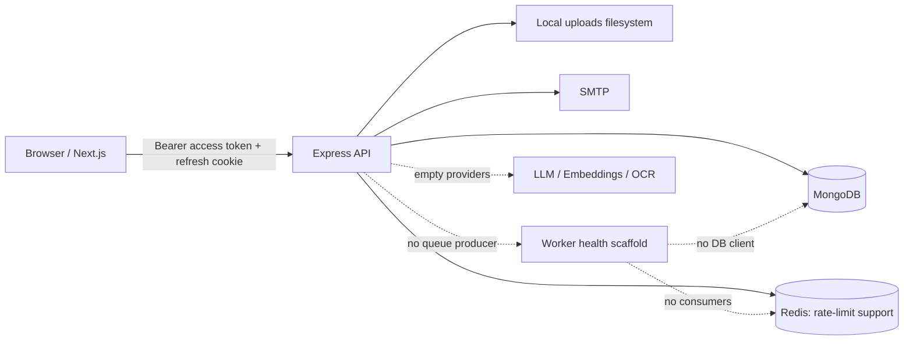
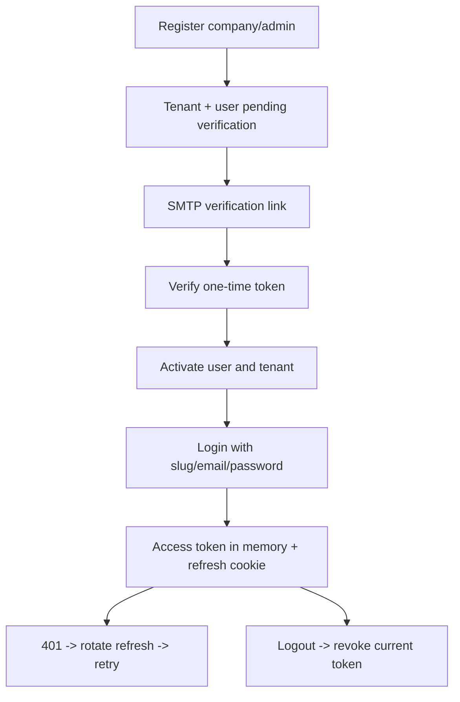
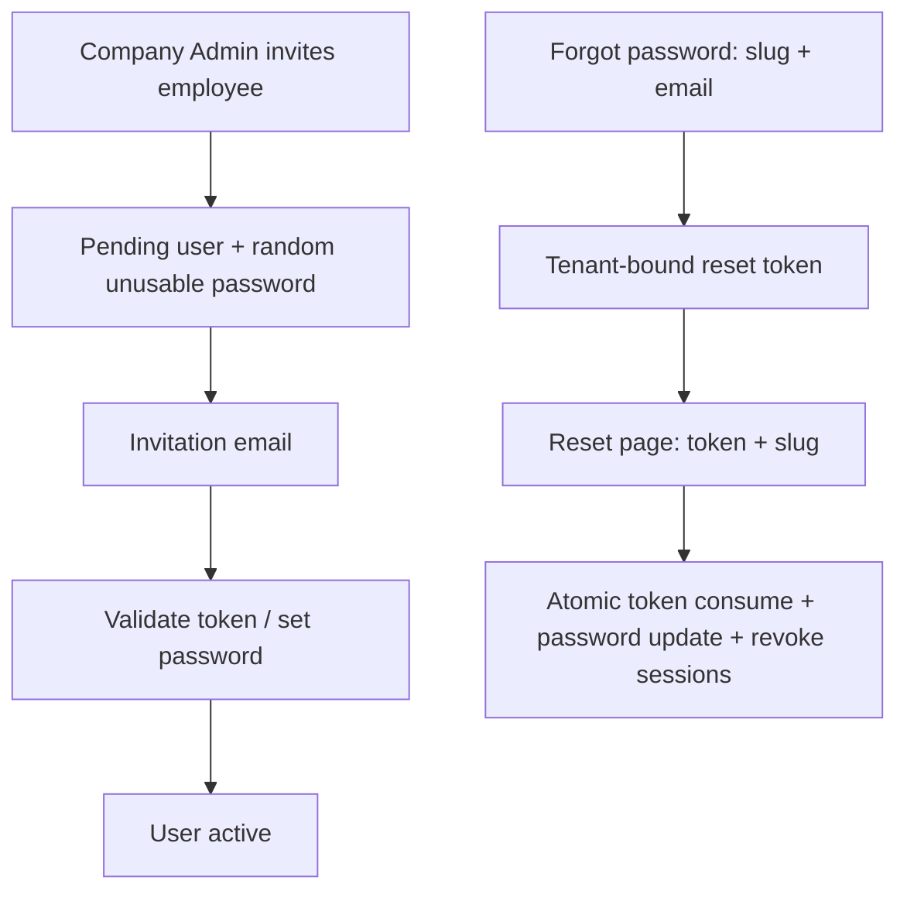
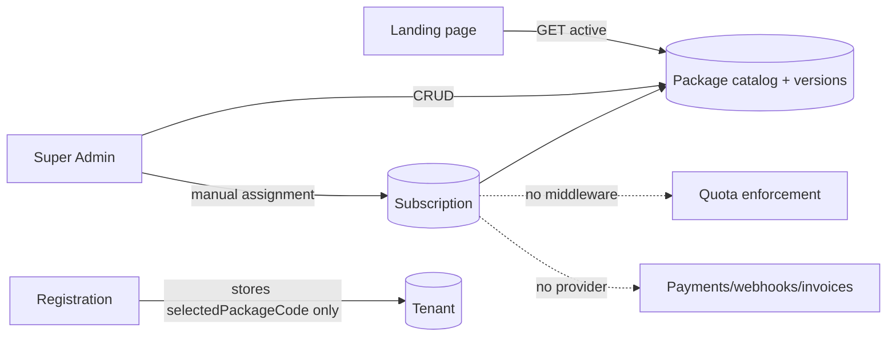

# DOCUMIND AI — Project Implementation Status

> Audit date: 2026-07-14. Source-of-truth order: executable source and observed command results, then configuration, then repository documentation. Status vocabulary is restricted to: **COMPLETE**, **PARTIAL**, **NOT IMPLEMENTED**, **BLOCKED**, **NEEDS VERIFICATION**, **DOCUMENTATION ONLY**, **FRONTEND ONLY**, **BACKEND ONLY**, **MOCKED / STATIC**, and **DEPRECATED / UNUSED**.

## 1. Executive Summary

DOCUMIND AI is an npm-workspaces TypeScript monorepo containing a Next.js 16 web application, an Express 5/Mongoose 9 API, and a nominal worker service. It currently provides a credible development demonstration of tenant registration and email verification, tenant-scoped login, refresh-token rotation, logout, password reset, employee invitation/set-password, tenant-scoped user and custom-role administration, document upload/list/delete, a public package catalog, and a broad Super Admin console. These areas are not uniformly release-complete: important tests, authorization granularity, quota enforcement, operational email verification, and end-to-end infrastructure validation remain.

The core product promise—document processing plus multilingual, cited RAG chat—is **NOT IMPLEMENTED**. Chat, retrieval, citations, knowledge-gap, feedback, analytics, processing, and tenant module source files are empty; their related Mongoose model files are empty. The worker explicitly logs that it has no jobs and has no MongoDB, Redis, BullMQ, parser, OCR, embedding, or vector-store dependencies (`workers/src/index.ts:18-32`, `workers/package.json`). The company dashboard and knowledge-gap display contain hard-coded/demo content (`app/src/app/(dashboard)/dashboard/page.tsx`, `app/src/app/(dashboard)/dashboard/knowledge-gaps/page.tsx`), while chat and analytics are “coming soon.”

The package/subscription implementation is an internal catalog and assignment layer, not billing. Package CRUD, public active-package retrieval, manual tenant subscription assignment, and UI pages exist (`api/src/modules/platform/platform.service.ts:81-191`; `app/src/services/super-admin.service.ts`). There is no payment provider, checkout, webhook, invoice, billing portal, renewal worker, plan seed, or quota middleware. Registration stores a selected package code but does not create a subscription (`api/src/modules/auth/auth.service.ts:319-325`).

Release readiness is **BLOCKED** by absence of the core RAG pipeline, worker failure, lint failure, no quota enforcement, no deployment configuration, and limited integration/security tests. Demo readiness is **PARTIAL**: authentication, administration, public pricing, employee management, roles, basic documents, and Super Admin screens can be demonstrated with configured MongoDB/Redis/SMTP; AI answers and processed documents cannot.

Major documentation drift: `README.md:3` presents an operational private knowledge assistant although no AI pipeline exists; `DocuMind-AI-Flow-and-APIs.md:3-22` correctly calls AI modules stubs but incorrectly says document upload is also only a stub; `CICD_DESIGN.md:53-60` says API/web test scripts do not exist although both now do.

## 2. Audit Methodology

The audit inspected all non-generated source under `api/src`, `app/src`, and `workers/src`; package manifests and lockfiles; Dockerfiles and Compose; CI; environment examples without copying secret values; repository Markdown; endpoint samples; uploaded-PDF presence; models, routes, controllers, services, repositories, middleware, providers, pages, guards, API clients, and tests. Generated `dist`, `.next`, and dependency internals were not treated as primary implementation evidence.

Feature status follows the strict definition in the brief. A route, empty scaffold, model, page, or documentation claim alone is not completion. Tests that only inspect source strings are identified as such. Runtime behavior requiring SMTP, live MongoDB/Redis, browser interaction, or external AI was not claimed without execution.

Limitations:

- No proposal/SRS PDF with the requested names was present. Four uploaded PDFs exist under `api/uploads` and `uploads`; they appear to be application data, not clearly named project documentation, and were not interpreted as requirements.
- Docker services were not started because that would mutate service/database state. Compose syntax was validated only.
- No seed command was executed because it writes data.
- No application code or existing documentation was modified.

## 3. Repository and Architecture Overview

| Path | Purpose | Evidence/status |
|---|---|---|
| `app/` | Next.js 16.2.10, React 19.2, Tailwind 4 web app | Active; App Router pages, client-side auth provider |
| `api/` | Express 5.2 API, Mongoose 9.7, Redis, SMTP | Active; registered routes in `api/src/app.ts:91-98` |
| `workers/` | Health server and configuration scaffold | **NOT IMPLEMENTED** job runner (`workers/src/index.ts:31`) |
| `docs/`, root `*.md` | bootstrap, architecture, backlog, design, CI plans | Mixed current/historical documentation |
| `secrets/` | Compose file-backed development secrets | Values intentionally not inspected/reproduced; committing secret files is a high-risk practice |
| `uploads/`, `api/uploads/` | local uploaded files | Local-only persistence; paths are split across two roots |
| `.github/workflows/ci.yml` | CI | Install, lint/typecheck/test/build design; no deployment |

Technology: npm 10 workspaces; TypeScript; Next.js/React; Express; MongoDB/Mongoose; ioredis; Zod; Argon2; JWT implemented without a listed JWT library; Nodemailer; Multer memory uploads/local filesystem; Pino; Vitest and Node test runner; Docker Compose with MongoDB 8 and Redis 7. No shared types package, OpenAPI/Swagger, Postman collection, vector database, LLM SDK, OCR engine, document parser, queue library, or payment SDK exists.

Request flow: the web API client keeps the access token in memory, sends it as Bearer authorization, and uses an HTTP-only refresh cookie; on 401 it performs one deduplicated refresh and retries (`app/src/lib/api-client.ts:165-318`). API authentication verifies claims; tenant middleware derives `req.tenantId` from authenticated claims, not request input (`api/src/common/middlewares/tenantScoping.middleware.ts`). Tenant repositories include tenant IDs in applicable queries.

Worker flow: none. Upload saves a file and document record in `uploaded` state (`api/src/modules/documents/documents.service.ts:55-93`) but creates no queue job. The worker only exposes health/readiness and reports no jobs (`workers/src/health.ts`, `workers/src/index.ts`).

## 4. Current User Roles

Actual base roles are `SUPER_ADMIN`, `COMPANY_ADMIN`, and `EMPLOYEE`. Custom roles store a display name plus a base role; they do not store or enforce permissions (`api/src/db/models/role.model.ts:3-8`, `api/src/modules/users/users.service.ts:131-152`).

| Capability | SUPER_ADMIN | COMPANY_ADMIN | EMPLOYEE | Evidence |
|---|---:|---:|---:|---|
| Platform overview/settings/packages/subscriptions | Yes | No | No | `api/src/modules/platform/platform.routes.ts:23-40` |
| Global tenant list/update | Yes | No | No | `api/src/modules/admin/admin.routes.ts:17-40` |
| Tenant user list | No | Yes | Yes | `api/src/modules/users/users.routes.ts:16-22` |
| Invite/update/delete tenant users | No | Yes | No | `api/src/modules/users/users.routes.ts:24-46` |
| Custom role CRUD | No | Yes | No | `api/src/modules/roles/roles.routes.ts:14-44` |
| Upload/list/read/update/delete any tenant document | No | Yes | Yes | `api/src/modules/documents/documents.routes.ts:37-75` |
| Chat/RAG | No | No | No | empty modules; no registered route |

The frontend protects all dashboard pages from guests, but ordinary `/dashboard/*` pages are not role-specific; only `/super-admin/*` has `RoleGuard("SUPER_ADMIN")` (`app/src/components/auth/auth-guard.tsx:20-43`, `app/src/app/(dashboard)/super-admin/layout.tsx:1-12`). Menu visibility is role-driven in `app/src/components/auth/app-navigation.tsx`, but backend guards remain authoritative. An employee can currently list every tenant user and mutate/delete every tenant document; whether intended is **NEEDS VERIFICATION**.

## 5. Feature Status Dashboard

| Module | Status | Backend | Frontend | Tests | Main Gap |
|---|---|---|---|---|---|
| Foundation/config | PARTIAL | Real API, Mongo/Redis, logging, health | Real health routes/design system | Utility/middleware tests | Worker omitted by root checks; no shared package/deploy |
| Authentication/account lifecycle | PARTIAL | Broad real lifecycle | Connected pages/provider | Good focused tests, not full E2E | No logout-all/lockout; SMTP not runtime-verified |
| Multi-tenancy/RBAC | PARTIAL | Claim-derived tenant scope, base-role guards | Guest/role guards | Middleware/repository tests | Coarse employee permissions; custom roles are labels |
| Super Admin | PARTIAL | Real overview/tenant/package/subscription/settings APIs | Broad connected console | Route/validator tests only | Some estimated/derived metrics; no deletion/impersonation |
| Companies/tenants | PARTIAL | Register/list/detail/suspend/reinstate/plan string | Connected platform/company views | Limited | No deletion/profile/limits lifecycle |
| Plans/packages | PARTIAL | Catalog CRUD + manual assignment | Public and admin UI connected | Validator/route source tests | No quota enforcement/default/seed |
| Billing/payments | NOT IMPLEMENTED | None | No checkout/portal | None | Provider, webhooks, invoices, lifecycle |
| Public landing | PARTIAL | Real public packages | Landing and package-to-register link | No page behavior tests | Terms/privacy `#`; no subscription checkout |
| Company Admin dashboard | MOCKED / STATIC | No dashboard endpoint | Hard-coded KPIs/activity | None | Real aggregation and actions |
| Employee management | PARTIAL | Invite/list/update/delete | Connected CRUD UI | No user integration test | No resend/revoke/bulk import/search |
| Email | PARTIAL | Verification/invite/reset templates and SMTP | Token pages connected | Mailer construction tests | No queue/retry/delivery integration |
| Documents | PARTIAL | Upload/list/detail/metadata/delete | Upload/list/delete connected | API service tests | No download/replace/reprocess/queue/ownership |
| Processing/worker | NOT IMPLEMENTED | Empty processing module | Status labels only | None | Entire pipeline and dependencies |
| AI/RAG/chat | NOT IMPLEMENTED | Empty providers/modules/models | “Coming Soon” | None | Entire AI capability |
| Knowledge gaps | MOCKED / STATIC | Empty | Preview/static page | None | Entire feature |
| Analytics/usage/cost | PARTIAL | Super Admin counts only | Super Admin real; company page coming soon | None | Token/cost/latency/event detail absent |
| Settings | PARTIAL | Platform blobs persist | Platform forms connected; company placeholder | Validator tests | Settings do not affect runtime |
| Frontend quality | PARTIAL | N/A | Responsive primitives, RTL/LTR, states | 161 web tests pass | Lint fails; dashboard mock content; client-only guards |
| Testing | PARTIAL | 17 test files | 16 suites/161 tests pass | Worker none | Missing E2E/RAG/queue/billing/security coverage |
| DevOps/deployment | PARTIAL | Compose/CI/Dockerfiles | Dockerfile/health | Compose config passes | No target/proxy/TLS/backup; worker broken |
| Seed data | PARTIAL | Guarded Super Admin seed only | N/A | Seed-service tests | No tenant/package/demo seeds |

## 6. Detailed Module Audit

### 6.1 Foundation, infrastructure, and configuration

| Feature | Expected Behavior | Status | Evidence | Missing Work |
|---|---|---|---|---|
| npm monorepo | Build/check three services | PARTIAL | root `package.json`; root commands executed only API/app | Make workspace scripts reliably include worker |
| MongoDB | Retry, readiness, persistence | PARTIAL | `api/src/db/connection.ts`; Compose volume | Live integration/startup not verified |
| Redis | Rate-limit backing/readiness | PARTIAL | `api/src/db/redis.ts`, `rateLimit.middleware.ts` | No cache/queue; fallback behavior needs production review |
| Errors/logging | Standard envelopes and correlated logs | COMPLETE | `errorHandler.middleware.ts`, request context/logger tests | Lint warnings remain |
| Environment/secrets | Validated per service | PARTIAL | `api/src/config/env.ts`, worker Zod config, secret-file utility | Web env not schema-validated; tracked secret files risk |
| Health | Dependency-aware readiness | PARTIAL | API `/healthz`, `/readyz`; web health routes | Worker readiness always 200 without dependencies |
| Production build | Build all services | BLOCKED | root build omitted worker; explicit worker typecheck fails | Restore workspace dependency resolution |

### 6.2 Authentication and account lifecycle

| Feature | Expected Behavior | Status | Backend Evidence | Frontend Evidence | Tests/Missing Work |
|---|---|---|---|---|---|
| Company registration | Create unique tenant/admin safely | PARTIAL | `auth.service.ts:296-443`; compound user index | register page connected | Transaction fallback retries any error (`:357-369`), risking ambiguous behavior; no E2E |
| Email verification/resend | One-time expiring token + activation | PARTIAL | `auth.service.ts:446-517`; mailer | `/verify-email` connected | Mailer tests; no DB/browser E2E |
| Tenant login | slug+email+password, active checks | PARTIAL | auth validator/service/repository | `/login`, safe `returnTo`, provider | No brute-force account lockout; 429 is generic API error UX |
| Super Admin login | Separate role-restricted login | PARTIAL | `/auth/super-admin/login` | `/super-admin/login` | Source tests, not E2E |
| Refresh/session | Hashed rotating tokens/reuse detection | PARTIAL | refresh-token model indexes; `auth.service.ts` | in-memory access token + cookie refresh | No full concurrent/reuse integration test |
| Logout | Revoke current refresh session | PARTIAL | `/auth/logout` | provider clears state | No logout-all endpoint/UI |
| Forgot/reset password | Tenant-explicit, one-time token, revoke sessions | PARTIAL | `auth.service.ts:181-293` | forgot page requires slug; reset requires token+slug | Tenant-isolation test exists; SMTP/browser E2E absent |
| Invitation/set password | Create pending user, email link, activate | PARTIAL | `users.service.ts:104-207,365-417` | connected set-password page | No resend/revoke invitation or delivery retry |
| Guest redirects | Authenticated users cannot revisit auth pages | PARTIAL | N/A | shared auth shell/`GuestOnly`; register also performs its own refresh | Duplicated registration bootstrap lifecycle; browser verification needed |

Duplicate emails are allowed across tenants by `{tenantId,email}` unique index (`user.model.ts:119-125`). Login and reset therefore require a company slug. Super Admin has a separately unique role index. Password reset correctly compares the URL slug’s tenant ID with the signed token tenant (`auth.service.ts:246-282`).

### 6.3 Tenant, users, roles, and email

- Tenant status/plan updates exist in both legacy Admin routes and broader Platform pages; there is no create-company endpoint outside registration, tenant delete, company profile/settings, trial dates, limits, or company-admin reassignment.
- User CRUD is tenant scoped and audited on update/delete (`users.service.ts:209-338`). List pagination exists; search/filter does not. Self-delete and last-admin protection are not evident.
- Custom role CRUD is real and tenant-scoped (`roles.service.ts`, `roles.test.ts`), but `baseRole` is the only authorization input; there is no permission collection or resource policy.
- SMTP abstraction provides verification/invitation/reset content (`auth.mailer.ts`). Development can disable sending and log status. There is no queue, retry, bounce handling, delivery state, or end-to-end SMTP test.
- Bulk employee import is **NOT IMPLEMENTED**: no `exceljs`, XLSX/CSV route, parser, preview, confirmation, idempotency key, import model, queue, worker, status/history/failure report/retry UI, or test was found.

### 6.4 Documents, processing, AI, and knowledge gaps

Basic document storage is **PARTIAL**. Multer limits size and allowlists MIME types (`documents.routes.ts:15-33`); local storage sanitizes/uniquifies paths (`api/src/providers/storage/index.ts`); DB operations include tenant scope; frontend uploads one file and lists/deletes via `useDocuments`/`documents.service.ts`. Extension/content-signature validation, malware scanning, quotas, duplicate detection, role/ownership access, download, replace, reprocess, retry, sorting/search, and reliable polling are absent. Employees receive the same document mutation privileges as admins.

Processing is **NOT IMPLEMENTED**: no producer/consumer, parser, cleaning, chunking, OCR, embeddings, vector indexing, retry/DLQ, progress, or idempotency. Uploaded documents remain `uploaded`. Empty evidence: `api/src/modules/processing/*`, `documentChunk.model.ts`; explicit worker statement `workers/src/index.ts:31`.

AI/RAG is **NOT IMPLEMENTED**. LLM/embedding/OCR providers and chat/retrieval/citation modules/models are empty. There is no tenant/role-filtered retrieval, hybrid search, reranking, prompt construction, injection defense, citations, refusal, confidence, bilingual validation, streaming, cancellation, fallback, token/cost/latency tracking, source viewer, or conversation persistence. `app/src/app/chat/page.tsx:18` is a coming-soon page.

Knowledge gaps and feedback are **NOT IMPLEMENTED** backend and **MOCKED / STATIC** frontend. The page explicitly says “Next release” (`knowledge-gaps/page.tsx:35-38`); all backend files and `knowledgeGap.model.ts` are empty.

### 6.5 Analytics, settings, landing, and frontend quality

Super Admin analytics are live MongoDB aggregations for counts, storage, audit events, question-event counts, and jobs represented by document state (`platform.service.ts:41-78,227-355`). Cost is a hard-coded `$0.002 * question count`, not provider billing (`:75,248`). Usage logs contain only tenant, event type, and request ID (`usageLog.model.ts`); token counts, model, latency, retrieval, user/document activity, exports, and date filters are absent. Company analytics page is coming soon.

Platform AI/general settings persist arbitrary validated blobs and are audited (`platform.service.ts:357-382`), but no runtime module reads them, so behavior control is **NOT IMPLEMENTED**. Company/user profile, password change, retention, security, and company subscription settings are missing or placeholders.

The landing page is substantial, responsive, bilingual, and fetches `/public/packages`; package CTAs pass `?package=code` to registration (`app/src/app/(public)/page.tsx:235-264`; register page). Terms/privacy/support links use `#` in dashboard/public content. There is no checkout/subscription selection beyond storing a code.

Frontend positives: reusable responsive layout primitives; mobile navigation; `min-w-0` and overflow wrappers in many tables/cards; loading/error/empty states on connected Super Admin pages; RTL/LTR translation infrastructure; refresh-aware API client. Gaps: no browser/E2E/a11y suite; company dashboard content and actions are static; search box is not integrated; lint errors include stale rule suppressions and unused imports; auth guards are client-side (backend remains protected); no observed browser run, so visual overflow/hydration claims remain **NEEDS VERIFICATION**.

## 7. Super Admin Implementation

All `/platform/*` API routes require authentication and `SUPER_ADMIN` (`platform.routes.ts:23-40`); tenant legacy routes do likewise (`admin.routes.ts`). Frontend `/super-admin/*` is role guarded.

| Page route | API | Data/status | Main limitation |
|---|---|---|---|
| `/super-admin` | `GET /platform/overview` | Real counts/audit; PARTIAL | Estimated cost formula; no real worker data |
| `/super-admin/companies`, `/companies/[companyId]` | `GET/PATCH /platform/tenants[/:id]` | Real | Duplicate with `/tenants`; no create/delete/impersonate |
| `/super-admin/tenants`, `/platform/tenants` | same legacy Admin API | Real | Parallel UIs/routes create maintenance duplication |
| `/super-admin/packages`, `/new`, `/[packageId]` | package GET/POST/PATCH | Real | No delete/default/feature flags/billing interval |
| `/super-admin/subscriptions` | GET/PATCH subscriptions | Real manual assignment | No payment/lifecycle automation |
| `/super-admin/users` | `GET /platform/users` | Real | Read-only; no tenant drilldown actions |
| `/super-admin/usage` | `GET /platform/usage` | Real coarse aggregates | No tokens/cost accuracy/date filters/export |
| `/super-admin/jobs` | `GET /platform/jobs` | Document statuses | Misnamed: no queue jobs |
| `/super-admin/system-health` | `GET /platform/system-health` | API/Mongo/Redis real flags | API hardcoded healthy; worker hardcoded not configured |
| `/super-admin/audit` | `GET /platform/audit` | Real audit records | Incomplete action coverage |
| `/super-admin/ai-configuration` | GET/PATCH setting | Persisted only | Does not affect AI/runtime |
| `/super-admin/settings` | GET/PATCH setting | Persisted only | Does not affect runtime |

Company-management layouts include responsive grids, truncation, wrapping, modal sizing, and mobile table containers, but no rendered viewport inspection was performed; visual status is **NEEDS VERIFICATION**. Code evidence does not confirm reported overflow bugs.

## 8. Packages, Plans, Subscriptions, and Billing

| Layer | Status | Evidence | Gap |
|---|---|---|---|
| Billing-ready data structure | PARTIAL | package/subscription models | No interval, trial duration, provider/customer IDs, tax/invoice fields |
| Internal catalog management | PARTIAL | platform service/routes/forms | No delete/default/seed; limited limits/features |
| Company-plan assignment | PARTIAL | `updateSubscription` | Manual only; tenant `plan` string can diverge from subscription |
| Quota enforcement | NOT IMPLEMENTED | No middleware/service callers | All stored limits unenforced |
| Subscription lifecycle | NOT IMPLEMENTED | Status/date fields only | No activation/expiry/renewal/grace/cancel jobs |
| Payment integration | NOT IMPLEMENTED | No SDK/routes/webhooks/UI | Entire provider/checkout/invoice/portal layer |

## 9. Authentication and Account Lifecycle

The diagrams in §6.2 are the implemented flows. Access tokens are memory-only (`app/src/lib/auth-tokens.ts`), reducing persistent XSS exposure; refresh is cookie-based and rotated. Cookie flags and controller behavior are in `auth.controller.ts`; production-domain/SameSite behavior requires deployed HTTPS verification. No CSRF token exists; refresh/logout rely on cookie policy and CORS, so cross-site deployment assumptions must be explicitly tested. Rate limiting wraps all auth routes (`auth.routes.ts:21`) with Redis-capable middleware; login UI does not provide dedicated retry-after/429 messaging.

## 10. API Inventory

All responses use the controller/error envelope; input validation is performed inside service validators rather than route middleware in most modules. “Tests” below means direct relevant automated coverage, not merely compilation.

| Module | Method and route | Handler/service | Auth/role/scope | Frontend caller | Tests | Status |
|---|---|---|---|---|---|---|
| Health | GET `/`, `/healthz`, `/readyz` | `app.ts` | Public | web health/ops | app tests | PARTIAL |
| Auth | POST `/auth/register` | register controller/service | Public | register page | app/auth tests | PARTIAL |
| Auth | POST `/auth/login` | login | Public, slug scoped | login page | app tests | PARTIAL |
| Auth | POST `/auth/super-admin/login` | super-admin login | Public endpoint; service enforces role | super-admin login | source test | PARTIAL |
| Auth | POST `/auth/refresh` | refresh rotation | Refresh cookie | API client/provider/register duplicate check | focused tests | PARTIAL |
| Auth | POST `/auth/logout` | revoke refresh | Cookie | provider | source test | PARTIAL |
| Auth | POST `/auth/complete-trial` | complete trial | Authenticated | No clear caller | none | BACKEND ONLY |
| Auth | POST `/auth/verify-email` | verify | Token | verify page (duplicated source/client implementations) | state/source tests | PARTIAL |
| Auth | POST `/auth/resend-verification-email` | resend | Public validated | verify UI | mailer tests | PARTIAL |
| Auth | POST `/auth/forgot-password`, `/reset-password` | password reset | Public; signed tenant + slug | connected pages | tenant isolation test | PARTIAL |
| Auth | GET `/auth/me` | session | Auth + tenant | provider | app tests | PARTIAL |
| Users | GET `/users` | list | Admin/employee, tenant | users page/service | none | PARTIAL |
| Users | POST `/users` | invite | Admin, tenant | users page/service | none | PARTIAL |
| Users | PATCH/DELETE `/users/:id` | update/delete | Admin, tenant | users page | none | PARTIAL |
| Users | POST `/users/validate-invite`, `/set-password-from-invite` | invite details/complete | Public token | set-password page | source test | PARTIAL |
| Roles | GET/POST `/roles`; PATCH/DELETE `/roles/:id` | role CRUD | Admin, tenant | roles/users pages | extensive service tests | PARTIAL |
| Documents | POST/GET `/documents`; GET/PATCH/DELETE `/documents/:id` | document CRUD | Admin/employee, tenant | upload/list/delete; detail/patch lack clear UI caller | service tests | PARTIAL/BACKEND ONLY |
| Admin tenants | GET `/platform/tenants`, `/:id`; PATCH `/:id` | admin module | Super Admin | two tenant/company UIs | no direct integration | PARTIAL |
| Platform | GET `/platform/overview` | platform service | Super Admin | overview | route source test | PARTIAL |
| Platform | GET/POST `/platform/packages`; GET/PATCH `/:id` | catalog | Super Admin | package pages | validator tests | PARTIAL |
| Platform | GET `/platform/subscriptions`; PATCH `/:tenantId` | assignments | Super Admin | subscriptions page | validator tests | PARTIAL |
| Platform | GET `/platform/users`, `/usage`, `/jobs`, `/system-health`, `/audit` | aggregations | Super Admin | matching pages | limited | PARTIAL |
| Platform | GET/PATCH `/platform/ai-configuration`, `/settings` | setting blobs | Super Admin | matching forms | validator tests | PARTIAL |
| Public | GET `/public/packages` | active packages | Public | landing | none | PARTIAL |
| Bootstrap | POST `/internal/bootstrap/super-admin` | bootstrap service | Feature flag + key + rate limit | No UI | validator/seed tests | PARTIAL |

No registered routes exist for chat, retrieval, citations, processing, analytics, feedback, knowledge gaps, or the empty tenants module. No frontend call without a matching registered backend route was found among active services; empty `auth.service.ts`, `chat.service.ts`, and `analytics.service.ts` frontend files are unused scaffolds. Duplicate concepts exist for companies/tenants and two verify-email component implementations (`page.tsx` and `verify-email-client.tsx`).

## 11. Database Model Inventory

| Model | Purpose/scope/indexes | Active status / risk |
|---|---|---|
| Tenant | Global tenant; unique slug, status index | Active; plan string may diverge from Subscription |
| User | Tenant user; unique `(tenantId,email)`, email index, single Super Admin partial unique index | Active; role is unconstrained string at schema level |
| RefreshToken | Tenant/user session; unique hashes, family/user/TTL indexes | Active |
| Role | Tenant custom role; unique normalized name per tenant | Active; no permissions |
| Document | Tenant metadata/storage path; tenant-created/status indexes | Active; no checksum/access policy/progress |
| AuditLog | Tenant actor/resource changes; tenant/time/resource indexes | Active but only selected actions emit logs |
| Package | Global catalog; unique code; embedded version history | Active; no default/billing interval/features |
| Subscription | One per tenant; package ref/status/dates | Active manual assignment; no lifecycle automation |
| PlatformSetting | Unique global key with arbitrary value | Active storage; runtime unused |
| UsageLog | Tenant + basic event/request; unique tenant/request partial index | Active only if called; too sparse for claimed analytics |
| Citation | Intended citation | DOCUMENTATION ONLY / empty file |
| Conversation | Intended chat | DOCUMENTATION ONLY / empty file |
| Message | Intended chat messages | DOCUMENTATION ONLY / empty file |
| DocumentChunk | Intended retrieval chunks | DOCUMENTATION ONLY / empty file |
| KnowledgeGap | Intended gaps | DOCUMENTATION ONLY / empty file |

There are no migrations. Mongoose index creation behavior and production index rollout are not documented. Tenant-scoped active models generally index tenant ID; global platform aggregations intentionally cross tenants under Super Admin guards.

## 12. Frontend Route and Page Inventory

| Route(s) | Role | Purpose | API Connected | Status/notes |
|---|---|---|---|---|
| `/` | Public | Marketing/pricing | Yes, public packages | PARTIAL; legal links/placeholders |
| `/login`, `/register`, `/super-admin/login` | Guest | Authentication | Yes | PARTIAL; browser redirect/429 verification needed |
| `/verify-email`, `/set-password-from-invite`, `/forgot-password`, `/reset-password` | Public token flow | Account lifecycle | Yes | PARTIAL |
| `/dashboard` | Authenticated | Company overview | No | MOCKED / STATIC metrics/activity |
| `/dashboard/users` | Authenticated UI; API admin mutations | Employees | Yes | PARTIAL |
| `/dashboard/roles` | Company Admin in API | Roles | Yes | PARTIAL |
| `/dashboard/documents` | Authenticated | Upload/list/delete | Yes | PARTIAL; no processing |
| `/dashboard/analytics`, `/dashboard/settings` | Authenticated | Planned panels | No | MOCKED / STATIC / coming soon |
| `/dashboard/knowledge-gaps` | Authenticated | Feature preview | No | MOCKED / STATIC |
| `/chat` | Authenticated only through page placement assumptions | AI chat | No | NOT IMPLEMENTED |
| `/super-admin/*` | Super Admin | Platform console | Mostly yes | PARTIAL; §7 |
| `/platform/tenants`, `/platform/tenants/[id]` | Protected, but no explicit frontend role guard in platform layout | Legacy tenant management | Yes | PARTIAL; backend is Super Admin; duplicate UI |
| `/health`, `/ready` | Public route handlers | Web probes | N/A | COMPLETE as web process probes |

An additional `app/logout/page.tsx` sits outside `app/src/app` and is not part of the configured App Router source tree; it is **DEPRECATED / UNUSED**. No frontend middleware file exists.

## 13. Background Jobs and Worker Status

| Area | Status | Evidence |
|---|---|---|
| Queue producer/consumer | NOT IMPLEMENTED | no BullMQ/queue dependency or code |
| Redis/Mongo worker connections | NOT IMPLEMENTED | config strings only; dependencies absent |
| Document processors | NOT IMPLEMENTED | empty API processing module; no worker processors |
| Bulk import | NOT IMPLEMENTED | no files/routes/dependency/UI |
| Retry/DLQ/idempotency/progress/history | NOT IMPLEMENTED | no job model or queue |
| Health/graceful shutdown | PARTIAL | HTTP server exists; no signal shutdown; readiness always ready |
| Container | BLOCKED | Dockerfile exists, but explicit typecheck cannot resolve `pino`; service would perform no work |

## 14. Testing and Validation Results

| Command (cwd repository root) | Result | Evidence/interpretation |
|---|---|---|
| `git status --short` | Passed | Initially clean (no output) |
| `npm run typecheck` | Passed, misleading scope | Ran API and app only; did not print worker |
| `npm test` | Passed, misleading scope | Ran API command and printed only `TAP version 13`; did not run web tests |
| `npm run test --workspace app` | Passed | 16 files, 161 tests passed |
| `npm run lint` | Failed | 9 errors, 25 warnings; unused imports, missing ESLint rule definitions, invalid `tmp-snippet1.ts`, unused worker constant |
| `npm run build` | Exit 0, NEEDS VERIFICATION | Printed API build and Next “Creating an optimized production build…” but no completion summary; worker omitted |
| `npm run typecheck --workspace workers && npm run build --workspace workers && docker compose config --quiet` | Failed at first command | `workers/src/structuredLogger.ts`: cannot resolve `pino`; chained build/Compose steps skipped |
| `docker compose config --quiet` | Passed | Compose syntax/interpolation valid |

Existing test coverage: API app envelopes, authorization/tenant/rate-limit middleware, request context/logging/secrets, tenant repository, mail construction, reset tenant isolation, documents, roles, platform validators/routes, and Super Admin seed. Web tests cover API client, auth navigation/provider source contracts, auth page source, invite/verification states, platform service, i18n, validation, design variants, and utility helpers. Several web/API tests are source-string/isolated tests rather than browser or live service integration.

Critically missing: browser E2E, full auth DB lifecycle, SMTP integration, user CRUD integration, cross-tenant resource attacks across all endpoints, custom role expectations, upload security, live Mongo/Redis Compose, worker, import, processing, RAG quality/security, billing, analytics accuracy, accessibility, responsive visual regression, and deployment smoke tests.

## 15. Security Audit

| Severity | Confidence | Finding | Evidence / remediation |
|---|---|---|---|
| Critical | Confirmed operational risk | Secret material is represented by repository files used directly by Compose | `secrets/*.txt`, `docker-compose.yml` secrets section. Rotate any real values, remove from version control/history, use deployment secret manager. Values were not read. |
| High | Confirmed | Core document authorization is coarse: employee can patch/delete any tenant document | `documents.routes.ts:37-75`. Define permissions/ownership and enforce resource policies. |
| High | Confirmed | Worker readiness is false-positive and worker cannot typecheck | `workers/src/health.ts:12-15`; explicit command failure. Make readiness dependency/job-registration aware. |
| High | Likely | Registration transaction fallback catches every `Error`, then retries non-transactionally | `auth.service.ts:357-369`. Restrict fallback to confirmed unsupported-transaction errors and make operation idempotent. |
| Medium | Confirmed | Custom roles do not confer custom permissions | role model/service and `authorize` base-role checks. Add permission model or rename feature to role labels. |
| Medium | Confirmed | Employee can list all tenant users | `users.routes.ts:16-22`. Verify business need and minimize returned data. |
| Medium | Confirmed | File validation trusts MIME and stores locally; no signature scan/malware scan/extension check | `documents.routes.ts:15-33`, storage provider. Add defense-in-depth and private object storage. |
| Medium | Needs verification | CSRF/cookie behavior depends on SameSite/domain/HTTPS deployment | auth controller + CORS. Add explicit threat-model and cross-site tests. |
| Medium | Confirmed | No quota enforcement permits unbounded users/uploads | package limits have no callers. Add atomic checks. |
| Medium | Confirmed | Audit logging is incomplete | only selected service actions call audit repository. Define security audit coverage. |
| Low | Confirmed | Production API URL falls back to localhost if env is absent | `app/src/lib/api-client.ts:8-10`. Fail production build/start on missing URL. |

Positive controls: Argon2 hashing; hashed one-time verification/reset JTIs; hashed refresh records, rotation/reuse detection and TTL; generic forgot-password responses; tenant-bound reset slug verification; claim-derived tenant context; tenant compound indexes; Zod validation; CORS allowlist; auth rate limiting; response sanitization; access token held in memory.

AI prompt injection/retrieval isolation cannot be evaluated because AI retrieval is absent. It must not be credited as secure merely because tenant IDs exist elsewhere.

## 16. Documentation Drift

### Documented but not implemented

| Requirement | Documentation Source | Actual Status | Evidence |
|---|---|---|---|
| Private cited RAG assistant | `README.md:3` | NOT IMPLEMENTED | empty chat/retrieval/provider/model files |
| Worker processing/embeddings/queue | root `package.json` description; README/backlog | NOT IMPLEMENTED | `workers/src/index.ts:31`, package dependencies |
| Full backlog epics | `checklist.md` | DOCUMENTATION ONLY for many issues | source inventory |
| Chat interface/drawers/OCR | `designe.md:180-202` | DOCUMENTATION ONLY | chat coming soon; no OCR |
| Deployment pipeline/design | `CICD_DESIGN.md` | DOCUMENTATION ONLY/PARTIAL | CI exists; no deployment configuration |
| Usage events after accepted chat query | `api/src/modules/usage/README.md` | BLOCKED | no chat endpoint invokes it |

### Implemented but not documented

| Feature | Actual Implementation | Evidence | Documentation Update Needed |
|---|---|---|---|
| Forgot/reset password with tenant slug | Connected backend/frontend | auth service/pages | Add endpoints/flow to `DocuMind-AI-Flow-and-APIs.md` |
| Packages/subscriptions/Super Admin console | Broad partial implementation | platform module/pages | Document internal-only status and gaps |
| Custom roles | Tenant CRUD + assignment | role module/pages | Document base-role limitation |
| Basic document CRUD | Real local storage/API/UI | documents module/page | Correct doc that calls it stubbed |
| Public dynamic pricing | Active package API + landing fetch | public service/page | Document package-to-register behavior |

Contradictions: `DocuMind-AI-Flow-and-APIs.md:3,22` says documents are empty although document CRUD is implemented; `CICD_DESIGN.md:53-60` says tests/scripts are absent although manifests now contain them; README product wording reads as current behavior rather than target architecture. `checklist.md` acceptance criteria are plans, not evidence of completion.

## 17. Known Incomplete or Suspicious Areas

- Package limits are stored but never enforced; tenant `plan`, selected package code, and Subscription can disagree.
- Super Admin “jobs” are document records, not queue jobs; cost is a formula, not actual token/provider cost.
- Company dashboard metrics, activities, AI suggestion, buttons, and legal links are static.
- Forgot/reset password is correctly slug-scoped in current code; this target is no longer missing, but needs E2E SMTP/browser validation.
- Login redirect uses safe-return logic; authenticated guest-page exclusion exists, while registration duplicates session restoration. Browser behavior remains **NEEDS VERIFICATION**.
- HTTP 429 is parsed as an `ApiError`; no tailored cooldown/retry-after login UX exists.
- Bulk import has no initial or later phase—`exceljs` is absent.
- Worker lacks runtime dependencies and jobs; root checks omit it.
- Landing pricing is API-driven, but selection only reaches registration and does not form a subscription/checkout.
- Backend-only or weakly connected endpoints: `/auth/complete-trial`, document detail/metadata patch, internal bootstrap. Empty frontend service/hook files are unused scaffolds.
- No meaningful automated tests exist for users, Super Admin service integration, public packages, SMTP delivery, subscriptions, or core promised features.

## 18. Blockers

| Blocker | Affected feature | Technical cause/evidence | Required decision/dependency | Recommended resolution |
|---|---|---|---|---|
| No AI architecture/provider | Core product | empty providers/chat/retrieval | Choose LLM, embeddings, vector store, retrieval policy | Define interfaces/threat model first |
| No functional worker/queue | Processing/import | no dependencies/jobs; worker typecheck fails | BullMQ/alternative, Redis/Mongo clients, parsers | Repair workspace then implement idempotent pipeline |
| No document parsing | RAG | no PDF/DOCX/TXT/OCR libs | Parser/OCR choices and language targets | Implement extraction test corpus |
| No billing decision | Paid plans | no provider/lifecycle | Payment provider, tax/currency/business rules | Keep internal plans distinct until decided |
| No quota enforcement | Plan integrity | limits have no runtime callers | Enforcement semantics and concurrency rules | Central quota service + atomic counters |
| CI/tooling gives false confidence | Release | root omits worker; lint fails | Workspace/lockfile policy | Make every service mandatory in CI |
| Local file storage | Deployment | bind-mounted uploads and split paths | Object storage, retention, backup | Adopt private durable object storage |
| Missing deployment/security context | Production | no proxy/TLS/backup/target | Hosting topology and domains | Produce deployment runbook/threat model |

## 19. Prioritized Remaining Work

| Priority | Task | Reason | Dependencies | Suggested Owner | Estimated Complexity |
|---|---|---|---|---|---|
| P0 | Rotate/remove tracked secrets and audit history | Credential exposure risk | Secret manager | DevOps/Security | Medium |
| P0 | Fix worker workspace/build and mandatory CI coverage | Current green root checks omit broken service | npm workspace/lockfile | Platform | Medium |
| P0 | Correct registration fallback/idempotency | Duplicate/partial tenant risk | Mongo transaction policy | Backend | Medium |
| P0 | Define/enforce document and user authorization | Excess employee access | Permission decisions | Security/Backend | Large |
| P1 | Implement document queue and reliable processing states | Required for core product | Worker, Redis, storage | Backend/ML | Very Large |
| P1 | Implement parsers/chunking/embeddings/vector index | Required for RAG | Provider decisions | ML/Backend | Very Large |
| P1 | Implement tenant/role-filtered cited RAG chat | Product promise | Processing pipeline | ML/Backend/Frontend | Very Large |
| P1 | Complete E2E auth/email tests and 429 UX | Account reliability | SMTP test system | QA/Full-stack | Large |
| P1 | Add package quota enforcement | Prevent unbounded use | Usage counters | Backend | Large |
| P2 | Complete employee invitation controls and bulk import | Admin completeness | Queue/idempotency | Full-stack | Very Large |
| P2 | Replace company dashboard/analytics static data | Honest product UI | chat/usage events | Full-stack | Large |
| P2 | Complete subscription lifecycle or explicitly scope it out | Product clarity | Billing decision | Product/Backend | Very Large |
| P2 | Durable private storage, download, scan, retry/reprocess | Document operations | Object storage | Platform/Backend | Large |
| P2 | Browser E2E, accessibility, responsive visual tests | Demo/release confidence | Stable flows | QA/Frontend | Large |
| P3 | Consolidate duplicate tenant/company and verification UIs | Reduce debt | Product naming | Frontend | Medium |
| P3 | Update README/API/CI documentation | Remove drift | Audit decisions | Tech writer/Lead | Small |

## 20. Recommended Implementation Phases

1. **Phase 0 — Security and build correctness:** secrets, authorization, registration idempotency, worker workspace, lint, truthful CI.
2. **Phase 1 — Account and tenant MVP hardening:** E2E auth/email/session tests, logout-all/lockout decision, last-admin/self-action protections, consolidated tenant administration.
3. **Phase 2 — Plans and resource controls:** unify tenant/package/subscription truth, seed catalog, enforce user/document/storage quotas atomically.
4. **Phase 3 — Document platform:** private durable storage, signature/security validation, download/reprocess, queue, parsing, progress/retry/DLQ/idempotency.
5. **Phase 4 — RAG core:** embeddings/vector store, tenant/role filters, retrieval/reranking, evidence prompts, citations/refusal, Arabic/English evaluation and injection defenses.
6. **Phase 5 — Product integration:** chat/source viewer, usage/token/cost events, real dashboards, knowledge gaps, admin analytics.
7. **Phase 6 — Commercial and administration completeness:** choose and implement billing lifecycle if in MVP; bulk employee import and operational reporting.
8. **Phase 7 — Production readiness:** E2E/load/security/a11y tests, observability, backups, deployment, proxy/TLS, incident/runbook and disaster recovery.

## 21. Definition of Done

A future feature is **COMPLETE** only when executable backend behavior, authentication/authorization, tenant/resource isolation, schema/input validation, persistence and idempotency where needed, error/empty/loading states, correct frontend/API integration, audit/usage events where applicable, automated happy-path and abuse/failure tests, successful lint/typecheck/build/tests for every affected workspace, deployment configuration, and current documentation all agree. Placeholder metrics, source-string tests, manual-only behavior, a model without enforcement, or an endpoint without its required UI remains partial.

## 22. Final MVP Checklist

### Foundation and accounts

- [x] npm workspace with API and web foundations
- [~] Worker workspace (scaffolded, broken/unimplemented)
- [x] Tenant registration, verification, login, refresh, current-session logout
- [~] Forgot/reset password and employee invitation (connected; E2E/delivery controls missing)
- [ ] Logout all, lockout policy, resend/revoke invitations
- [~] Tenant isolation/RBAC (strong base, coarse resource permissions)

### Administration and plans

- [~] User and custom-role administration
- [~] Super Admin tenant/company console
- [~] Package catalog and manual assignment
- [ ] Quota enforcement
- [ ] Real subscription lifecycle/payment integration
- [ ] Bulk employee import

### Documents and intelligence

- [~] Basic document upload/list/metadata/delete
- [ ] Queue and document processing
- [ ] PDF/DOCX/TXT extraction and OCR
- [ ] Chunking, embeddings, vector indexing
- [ ] RAG chat, citations, refusal, source viewer
- [ ] Knowledge gaps/feedback
- [~] Analytics (coarse Super Admin only)

### Quality and operations

- [x] Web unit/source tests (161 passing)
- [~] API tests (present; root runner output is not sufficiently informative)
- [ ] Worker tests and successful worker typecheck
- [ ] Clean lint and verified full production build
- [ ] Browser E2E/security/a11y/visual tests
- [~] Docker Compose development config
- [ ] Production deployment, TLS/proxy, backup, durable upload storage

## 23. Final Conclusions

The current system can demonstrate public dynamic pricing, company onboarding and verification (with working SMTP), tenant login/session recovery, password reset, employee invitation and CRUD, custom role labels, local document CRUD, and a connected Super Admin console with real database-backed platform views. It cannot demonstrate processed documents, AI chat, retrieval, citations, knowledge gaps, accurate token/cost analytics, bulk import, quota enforcement, automated subscription billing, or a functional background worker.

The repository is development-ready for continuing the implemented administration/authentication areas, but the worker/tooling baseline must be repaired before parallel pipeline work. It is **PARTIAL** for a supervised demo and **NOT production-ready**.

The next five actions are:

1. Rotate/remove tracked secrets and repair CI so all three workspaces must lint, typecheck, test, and build.
2. Fix registration idempotency and define/enforce employee resource permissions.
3. Choose the queue, storage, parser/OCR, embedding, vector-store, and LLM architecture.
4. Build the idempotent document-processing pipeline with tenant-aware tests.
5. Build cited, tenant/role-filtered RAG and replace static dashboards with real usage events.
