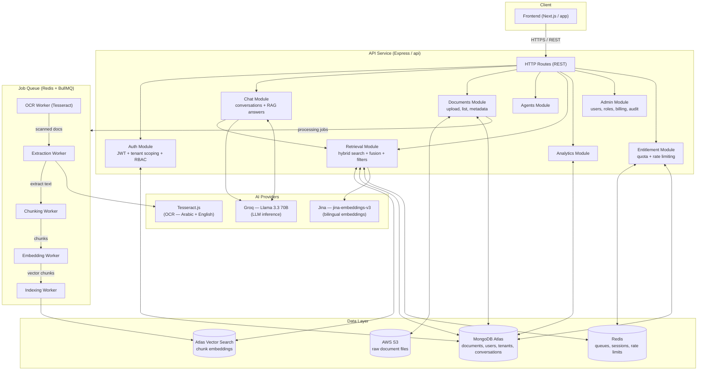

# DocuMind AI — System Architecture

> High-level overview of the DocuMind AI platform: a private, multi-tenant AI
> knowledge assistant. Admins upload internal documents (HR policies, SOPs,
> contracts) in Arabic or English; employees ask natural-language questions and
> get answers generated only from those documents, with source citations.

---

## Architecture Diagram

---

## Component Responsibilities

### Frontend (Next.js)

- Server-rendered Next.js application under `app/`.
- Talks to the API over REST (`/api/v1`) with a JWT bearer token.
- Organised by feature: `src/app`, `src/components`, `src/services`, `src/hooks`.

### API Service (Express)

Feature-based monolith under `api/src/modules/`. Every module follows the same
shape: `routes.ts` → `controller.ts` → `service.ts` → `repository.ts` →
`validator.ts` → `types.ts`.

| Module | Responsibility |
| --- | --- |
| Auth | Registration, login, JWT refresh/rotation, email verification, password reset |
| Chat | Conversations, streaming/RAG answers with citations |
| Documents | Upload, list, metadata, versions, archive, download, preview |
| Retrieval | Hybrid retrieval (vector + keyword) with fusion, tenant access filters |
| Agents | AI agents that compose retrieval + intent-aware query rewriting |
| Analytics | Dashboard stats: queries, documents, cost, quality, usage |
| Admin | User & role management, billing, subscription, entitlements, audit log |
| Entitlement | Per-tenant quota enforcement (documents, storage, queries, OCR pages) |

### Workers (BullMQ)

Consume jobs published by the API over Redis. Each worker handles one stage of
the document pipeline:

1. **OCR Worker** — `tesseract.js` on scanned/PDF documents (Arabic `ara` + English models).
2. **Extraction Worker** — extracts raw text from PDF, DOCX, XLSX, and scanned images.
3. **Chunking Worker** — splits extracted text into semantic chunks (paragraph / structural / table strategies).
4. **Embedding Worker** — calls Jina to produce 1024-dim bilingual embeddings.
5. **Indexing Worker** — writes embeddings into Atlas Vector Search with tenant isolation.

### Data Layer

| Store | Purpose |
| --- | --- |
| MongoDB Atlas | Primary database — tenants, users, roles, documents, conversations, audit log |
| Atlas Vector Search | Embedding index for semantic search; inherits MongoDB tenant isolation |
| Redis | BullMQ job queues, refresh-token sessions, rate limiting, deduplication |
| AWS S3 | Durable storage of raw document files |

### AI Providers

| Provider | Role |
| --- | --- |
| Groq (`llama-3.3-70b-versatile`) | High-throughput LLM inference for chat answers |
| Jina (`jina-embeddings-v3`) | Bilingual (EN + AR) text embeddings |
| Tesseract.js | Self-hosted OCR with Arabic language support |

---

## Request Flow — "Ask a question"

1. Frontend sends `POST /chat/send { message }` with a bearer token.
2. Auth middleware validates the JWT, tenant scoping resolves the tenant, and RBAC checks the `CHAT_CREATE` permission.
3. The entitlement guard consumes one query from the tenant's monthly quota (fail-closed).
4. The Chat module persists the user message and loads conversation history.
5. The intent-query agent rewrites/clarifies the question when needed.
6. The Retrieval module runs hybrid search (vector + keyword) filtered by the user's document-access permissions.
7. Retrieved chunks are embedded/reranked and passed to the LLM (Groq) as context.
8. The answer is streamed back with source citations and stored in the conversation.

---

## Request Flow — "Upload a document"

1. Frontend sends `POST /documents` (multipart) with bearer token.
2. Auth + RBAC (`DOCUMENTS_CREATE`) + entitlement checks (document count, storage MB) pass.
3. The file is scanned for malware, checksummed, stored in S3, and a document record is created in MongoDB.
4. A processing job is enqueued to Redis → workers run OCR → extraction → chunking → embedding → indexing.
5. The document's `searchStatus` transitions `STALE → INDEXING → READY`, visible via `GET /documents/:id/extraction`.
